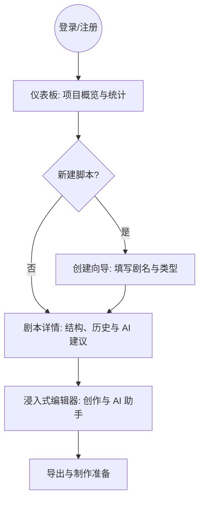

# 剧灵 - 短剧剧本开发工具 PRD

**版本：** v1.6
**创建日期：** 2026-01-22
**最后更新：** 2026-01-23 (v1.6 - P0问题修复 + P1/P2技术细节补充)
**审核人：** Claude Code (Antigravity v4.8)
**产品类型：** Web应用
**核心定位：** 剧灵，一支懂你的笔 — AI 驱动的短剧剧本创作管理平台

---

## 一、产品概述

### 1.1 产品愿景

**“让灵感，在剧本中苏醒”**

打造一个全图形化、AI驱动的短剧剧本开发工具，通过系统化的创作流程管理和智能辅助，帮助编剧和制作团队高效完成从世界观构建到制作准备的完整创作周期。我们相信，在创作路上，你不孤单。

### 1.2 产品价值

- **流程化管理：** 将项目的科学创作流程固化到产品中，引导用户遵循最佳实践
- **AI辅助创作：** 集成AI能力辅助世界观生成、人物创作、剧本优化，降低创作门槛
- **全图形化界面：** 提供直观的可视化操作界面，无需技术背景即可使用
- **协作友好：** 支持团队协作，满足个人创作者到制作公司的不同规模需求

### 1.3 核心创作流程


### 1.4 核心用户路径 (User Journey)



---

## 二、市场分析

### 2.1 市场规模与机会

#### 短剧市场爆发式增长
- **市场规模**：中国短剧市场 2023 年规模超过 370 亿元，预计 2024 年将突破 500 亿元
- **内容需求**：短剧年产量超过 10 万部，每部平均 80-100 集，剧本需求量巨大
- **行业痛点**：制作周期短（平均 2-4 周），剧本创作效率成为瓶颈

#### 剧本创作工具市场现状
- **传统工具**：Final Draft、Celtx、WriterDuet 等主要面向电影/电视剧，价格昂贵（$200-$300/年）
- **国产空白**：缺乏针对短剧特点（快节奏、强反转、集数多）的专业工具
- **AI 新机会**：AI 大模型技术成熟，可大幅降低创作门槛，提升创作效率

**市场机会**：打造"短剧专属 + AI 驱动 + 中文友好"的剧本创作工具，填补市场空白。

---

### 2.2 竞品分析

#### 2.2.1 直接竞品对比

| 产品 | 定位 | 优势 | 劣势 | 差异化机会 |
|------|------|------|------|-----------|
| **Final Draft** | 好莱坞行业标准 | 格式规范、专业性强 | 价格高（$249）、无AI、中文支持弱 | ✅ 短剧专用 + AI + 中文优化 |
| **Celtx** | 全流程制作工具 | 免费、功能全面 | 协作收费、界面复杂、AI功能弱 | ✅ 简洁易用 + AI 深度集成 |
| **WriterDuet** | 实时协作编剧 | 协作强、实时编辑 | 价格贵（$144/年）、学习曲线陡 | ✅ 性价比 + 创作流程引导 |
| **壹写作** | 国产编剧软件 | 中文优化、价格低 | 功能单一、界面陈旧、无AI | ✅ 现代化 UI + AI 辅助 |
| **AI 写作助手** | AI 生成内容 | 门槛低、快速生成 | 缺乏结构化管理、格式不规范 | ✅ 结构化创作 + 格式规范 |

#### 2.2.2 竞争策略

**我们的差异化定位：**
1. **垂直专注短剧**：针对短剧特点优化（80-100 集、快节奏、强反转）
2. **AI 深度集成**：不仅是生成，更是辅助（优化、检查、建议）
3. **中文优先**：中文剧本格式规范、中文语言习惯优化
4. **流程引导**：将成功的《我送君归去》创作流程产品化
5. **性价比高**：价格只有国际产品的 1/5

**核心竞争优势：**
- 🎯 **短剧专属**：内置短剧创作最佳实践与引导流程
- 🤖 **AI 智能助手**：不是替代编剧，而是赋能编剧
- 🇨🇳 **中文优化**：深度理解中文剧本格式和语言习惯
- 💰 **性价比**：个人版免费，专业版仅 ¥299/年（Final Draft 的 1/5）

---

### 2.3 用户画像

#### 2.3.1 核心用户类型

| 用户类型 | 占比 | 核心需求 | 使用场景 | 支付意愿 | 优先级 |
|---------|------|---------|---------|---------|--------|
| **独立编剧** | 40% | 效率工具、AI 辅助 | 个人创作、兼职接单 | 中等（¥50-100/月） | P0 |
| **业余创作者** | 30% | 降低门槛、学习引导 | 尝试创作、爱好探索 | 低（免费-¥30/月） | P0 |
| **编剧团队** | 20% | 协作、版本管理 | 团队项目、公司项目 | 高（¥300-500/月） | P1 |
| **制作公司** | 10% | 全流程管理、对接制作 | 商业项目、批量生产 | 很高（¥1000+/月） | P2 |

#### 2.3.2 用户故事（User Stories）

**故事 1：新手编剧的第一次创作**
> **角色**：李明，24 岁，刚毕业的文学爱好者
> **背景**：想尝试短剧创作，但不知道从何开始
> **痛点**：
> - 不知道世界观怎么构建
> - 人物关系容易混乱
> - 剧本格式不规范
> - 创作过程中容易卡住
>
> **Scripter 如何帮助**：
> 1. 引导式创建向导，一步步完成世界观、人物、剧本
> 2. AI 辅助生成世界观设定和人物小传
> 3. 实时格式检查，确保符合行业规范
> 4. AI 建议：卡住时提供情节发展建议
>
> **预期结果**：1 个月完成第一部 80 集短剧剧本

---

**故事 2：职业编剧的效率提升**
> **角色**：王芳，32 岁，自由职业编剧
> **背景**：每月需要完成 2-3 部短剧剧本
> **痛点**：
> - 时间紧，经常加班赶稿
> - 多个项目并行，容易混乱
> - 人物前后矛盾需要反复检查
> - 修改历史管理困难
>
> **Scripter 如何帮助**：
> 1. 使用经过验证的短剧创作流程启动新项目
> 2. 多项目管理视图，清晰追踪每个项目进度
> 3. AI 自动检查人物一致性和情节逻辑
> 4. 版本历史记录，随时回溯
> 5. AI 辅助优化对白，节省时间
>
> **预期结果**：每月从完成 2 部提升到 3-4 部，收入增加 50%

---

**故事 3：制作团队的协作需求**
> **角色**：张伟，40 岁，短视频制作公司负责人
> **背景**：团队有 5 名编剧，每月制作 10 部短剧
> **痛点**：
> - 编剧协作时版本混乱
> - 剧本到分镜需要人工转换
> - 选型、道具管理分散
> - 项目进度难以追踪
>
> **Scripter 如何帮助**：
> 1. 实时协作编辑，避免版本冲突
> 2. 自动生成分镜头脚本
> 3. AI 生成人物人设图，辅助选型
> 4. 项目看板视图，实时追踪进度
> 5. 一键导出制作清单（角色、道具、场景）
>
> **预期结果**：团队效率提升 30%，每月可制作 13-15 部短剧

---

### 2.4 用户痛点总结

基于用户调研和用户故事，我们识别出以下核心痛点：

| 痛点 | 严重程度 | 影响用户 | Scripter 解决方案 |
|------|---------|---------|------------------|
| **创作流程混乱** | 🔴 高 | 所有用户 | 引导式创作流程 + 阶段管理 |
| **内容一致性难保证** | 🔴 高 | 新手、职业编剧 | AI 自动检查 |
| **格式规范难统一** | 🟠 中 | 新手、业余创作者 | 实时格式检查 |
| **创作门槛高** | 🟠 中 | 新手、业余创作者 | AI 辅助生成 + 创作建议 |
| **协作效率低** | 🟡 低 | 团队、制作公司 | 实时协作 + 版本控制 |
| **时间紧任务重** | 🔴 高 | 职业编剧、制作公司 | AI 优化 + 批量操作 |

---

## 三、核心功能设计

### 3.1 功能模块架构

```
Scripter
├── 项目管理模块
│   ├── 项目创建与配置
│   └── 创作进度追踪
├── 世界观构建模块
│   ├── 时代背景设定
│   ├── 地理环境设定
│   ├── 神秘元素设定
│   └── 社会阶层设定
├── 人物塑造模块
│   ├── 人物小传编辑
│   └── 人物成长轨迹
├── 剧本创作模块
│   ├── 故事大纲编辑
│   ├── 场景列表管理
│   └── 剧本编辑器
├── 优化完善模块
│   ├── 对白优化
│   ├── 节奏调整
│   ├── 情节补充
│   └── 逻辑检查
├── 制作准备模块
│   ├── 分镜管理
│   ├── 角色选型建议
│   └── 道具场景清单
└── AI辅助模块
    ├── 世界观生成
    ├── 人物创作
    ├── 场景生成
    └── 剧本优化
```

### 3.2 功能优先级与分阶段规划

#### 3.2.1 MVP 功能范围（第一阶段 - 1.5-2 个月）

**核心目标：** 验证"剧本编辑 + AI 辅助"的核心价值，快速获取用户反馈

**P0 必须功能：**

1. **核心功能六项同步开发** ✅
   - **控制台 (Dashboard)**：项目概览、今日创作字数、最近编辑项目（玻璃拟态卡片视图）。
   - **剧本 (Editor)**：A4 标准校对模式、段落级拖拽排序、AI 润色助手、打印导出预览。
   - **人物 (Characters)**：人物档案卡片流、AI 生成人设、人物诗号生成。
   - **场景 (Scenes)**：看板式管理、环境（日/夜/内/外）标签、状态流转（草稿/已完成）、场景 AI 渲染图占位。
   - **世界观 (Worldview)**：多维设定（时代、背景、阶层）、结构化编辑器、AI 设定编织。
   - **分镜 (Storyboard)**：分镜脚本编辑器、专业“画面-声音”四栏排版、AI 运镜建议。

2. **剧本编辑器 (Enhanced)** ✅
   - 支持 A4 标准物理布局（210mm x 297mm）。
   - 实时格式检查与提示（场景、动作、角色、对话）。
   - 导出为 Word/PDF（保持 A4 格式）。

3. **基础 AI 辅助** ✅
   - AI 对白优化、场景扩展、情节建议。
   - 实现 Intention Dispatcher 意图路由。

4. **基础项目管理** ✅
   - 全局 6 项导航菜单同步开发。
   - 自动保存与版本历史。

**MVP 段落级拖动说明 (P0)：**
- **场景列表拖拽**：调整场景顺序，自动重新编号。
- **段落级拖拽**：在编辑器内拖动“场景标题”、“动作描述”、“对话块”进行排序，带金色插入指示线。

**MVP 段落内部/句子级拖拽 (移到 Stage 2)：**
- ❌ 句子级精确拖动。
- ❌ 跨场景段落拖动（复杂逻辑）。

**MVP 验收标准：**
- ✅ 用户可以在 30 分钟内完成第一个剧本场景创作
- ✅ AI 辅助功能使用率 > 40%
- ✅ 格式检查准确率 > 95%
- ✅ 获取 50 个种子用户，周活跃率 > 30%

---

#### 3.2.2 第二阶段（2-3 个月）

**核心目标：** 完善创作流程，提升用户粘性

**新增功能：**
1. **高级 AI 功能**
   - AI 生成完整场景
   - AI 检查人物一致性
   - AI 检查情节逻辑

2. **专注模式**
   - 隐藏所有侧边栏
   - 沉浸式写作体验

3. **优化完善模块**
   - 对白批量优化
   - 节奏分析
   - 字数统计与时长估算

---

#### 3.2.3 第三阶段（3-4 个月）

**核心目标：** 完善协作与制作对接功能

**新增功能：**
1. **实时协作编辑**
   - 多人同时编辑
   - 实时评论与批注
   - 权限管理

2. **高级 AI 图片生成**
   - 人物人设图生成
   - 场景概念图生成
   - 图片管理与导出

3. **制作准备深化**
   - 角色选型建议
   - 道具场景清单
   - 一键导出制作文档

---

#### 3.2.4 第四阶段（商业功能，按需启动）

**核心目标：** 商业化与生态建设

**新增功能：**
1. **高级协作**
   - 团队工作区
   - 社区素材库

2. **数据分析**
   - 创作习惯分析
   - AI 使用效率报告
   - 项目进度报表

3. **移动端适配**
   - iOS/Android App
   - 移动端阅读模式
   - 快速编辑功能

4. **API 与集成**
   - 开放 API
   - 第三方工具集成（Notion、飞书等）
   - 插件系统

---

## 四、技术架构

### 4.1 技术栈

**前端框架：**
- **Next.js 14+ (App Router)** - 现代化全栈框架
  - 优势：SSR/SSG支持、性能优秀、SEO友好
  - 特性：启用 **View Transitions API**，通过 `same-origin` 元标签实现 SPA 级别的原生页面平滑过渡动效，维持侧边栏在跳转时的视觉稳定性。

**UI组件库：**
- **shadcn/ui + Tailwind CSS** - 现代化UI组件
  - 优势：美观、可定制、开发效率高
  - 设计语言：纸质写作主题 (Paper Writer Theme)
  - 核心色彩：
    - 背景色：#F5F1E8（温暖米色，米质纸张感背景）
    - 表面色：#FFFFFF（白色 - 编辑容器、侧栏、卡片）
    - 文字主色：#1A1A1A（深墨黑）
    - 文本副色：#5C5548（深褐）
    - 品牌主色：#C9A962（古典金色 - 用于品牌、高亮、重点按钮）
    - 品牌深色：#A68A45（暗金 - 用于禁用状态或深色背景）
    - 边框色：#D3C9B0（浅褐 - 分隔线、边框）
  - 字体系统：
    - UI 正文：Inter + Noto Sans SC
    - 品牌标题：Noto Serif SC (思源宋体)
    - 编辑区：Courier Prime + Noto Sans SC (18px 打字机质感，行高 1.6)
  - 间距系统 (8px 网格)：xs: 4px | sm: 8px | base: 12px | md: 16px | lg: 20px | xl: 24px | 2xl: 32px
  - 圆角规范：sm: 4px | base: 8px | lg: 12px（模态框、卡片）| full: 9999px
  - 阴影规范：subtle (0 2px 8px rgba(0,0,0,0.04)) | base (0 4px 12px rgba(26,26,26,0.05)) | float (取消，改为平面集成)
  - 纹理应用规范：
    - **应用区域**：主工作区背景、仪表板主区域、剧本详情页主区域
    - **不应用区域**：左侧深色导航栏、右侧AI面板、A4白色编辑器容器、模态框与弹窗
    - **纹理参数**：URL: https://www.transparenttextures.com/patterns/natural-paper.png (透明度 0.3, 平铺 repeat)
  - 特殊组件：
    - 模态框：带有毛玻璃效果背景 (backdrop-filter: blur(4px)) 和优雅的缩放/位移动效。

**图标系统：**
- **Lucide Icons** - 几何极简风格
  - 线条粗度：2px
  - 圆角：2px
  - 尺寸：32x32px 标准，支持 16-64px 缩放
  - 颜色：#1A1A1A（常规）、#C9A962（AI/选中）
  - 细节：同步登录页风格，使用金色渐变辅助。

**全站侧边栏系统 (v4.6)：**
- **集成化设计**：移除“浮窗”与“绝对定位”，采用标准 Flex/Relative 集成面板。侧边栏高度 `100vh` 顶天立地，与主内容区无缝贴合。
- **左侧导航 (Unified Nav)**：强制同步全站 6 项核心菜单（控制台、剧本、人物、场景、世界观、分镜），保持绝对的肌肉记忆一致性。
- **Logo 品牌化**：
    - Logo 区域包含"剧灵"中文标识与英文后缀 `scripter.art`
    - **英文后缀规范**：位置-标准字下方或右侧 | 字体-Noto Sans SC Bold 8px | 颜色-#C9A962 | 字间距-0.3em | 透明度-70%
    - 点击可返回欢迎页 (00-welcome)
- **右侧侧栏 (Right Sidebar)**：
    - **顶部用户信息 (User Header)**：显示头像、用户名、Pro 标识及设置。全页面一致，作为侧栏首选焦点。
    - **中部 AI 助手 (Standard Assistant)**：顶部 Bot 标识及状态呼吸灯，中部异步消息列表，底部集成式输入区。
- **折叠交互 (Edge Controls)**：折叠按钮固定在浏览器窗口的最左/右边缘，垂直方向 50% 居中。
- **视觉分割**：采用纯色背景 + `1px solid #D3C9B0` 物理边框，保持平面化极简高级感。**不使用玻璃拟态效果**（仅模态框使用）。

**剧本编辑器 (Editor Core)：**
- **TipTap** - 富文本编辑器框架
  - 优势：无头设计、高度可定制、支持协作
  - 扩展：实时协作、AI集成、格式化工具
- **布局结构 (A4 Integrated Layout)：**
  - **A4 标准纸张方案** (v4.7)：
    - 编辑器主容器宽度对标 A4 物理标准 (210mm)。
    - 实现 **Print Style**：支持 `@media print` 样式，在导出 PDF 时自动隐藏侧边栏与工具栏，保持 1 英寸 (25.4mm) 标准边距。
    - 垂直堆叠模式：当内容超过一页时，通过阴影物理分隔页面，保持纸张视觉质感。
  - **左侧导航栏**：平面白色背景，`h-full` 撑满。包含 6 项全局菜单及当前章节树。
  - **中间工作区**：米色纸感背景 (#F5F1E8)。工作区采用 `flex justify-center` 衬托中间的白色 A4 纸张编辑器，两侧无缝贴合面板。
  - **右侧 AI 面板**：白色背景。包含标准模版化的 AI 创作伙伴。

**AI集成：**
- **Vercel AI SDK** - AI应用开发工具包
  - 优势：统一的Provider API、流式响应、Tool Use
  - 模型：支持Claude、GPT-4等多种模型

**数据库：**
- **Prisma + PostgreSQL** - 类型安全的ORM
  - 优势：类型安全、迁移管理、关系查询

**认证系统：**
- **NextAuth.js** - 成熟的认证方案
  - 支持：邮箱登录、OAuth、第三方登录

**实时协作：**
- **Socket.io** - WebSocket实时通信
  - 场景：多人编辑、实时评论

**拖动功能：**
- **@dnd-kit/core** - 现代化拖拽库
  - 优势：性能优秀、可访问性友好、支持嵌套拖拽
  - 场景：场次、段落、句子、文本的拖动

**AI图片生成：**
- **Replicate API** - 统一的AI模型API网关
  - 支持：Stable Diffusion、DALL-E、Midjourney
  - 优势：统一接口、按需付费、无需自建GPU服务器
- **备选方案：** 直接集成 Stability AI / OpenAI DALL-E API

**图片存储：**
- **AWS S3 / 阿里云OSS** - 对象存储
  - 存储AI生成的图片
  - CDN加速图片访问

### 4.2 系统架构图

```
┌─────────────────────────────────────────────────────────┐
│                      用户界面层                           │
│  ┌──────────┐  ┌──────────┐  ┌──────────┐  ┌──────────┐ │
│  │剧本编辑器│  │世界观管理│  │人物管理  │  │分镜管理  │ │
│  │[拖动功能]│  │          │  │          │  │          │ │
│  └──────────┘  └──────────┘  └──────────┘  └──────────┘ │
│  ┌──────────┐  ┌──────────┐                            │
│  │AI助手   │  │图片生成  │                            │
│  └──────────┘  └──────────┘                            │
└─────────────────────────────────────────────────────────┘
                            ↓
┌─────────────────────────────────────────────────────────┐
│                      业务逻辑层                           │
│  ┌──────────┐  ┌──────────┐  ┌──────────┐  ┌──────────┐ │
│  │项目管理  │  │格式检查  │  │拖动逻辑  │  │版本控制  │ │
│  └──────────┘  └──────────┘  └──────────┘  └──────────┘ │
│  ┌──────────┐  ┌──────────┐  ┌──────────┐              │
│  │图片生成  │  │分镜管理  │  │权限管理  │              │
│  └──────────┘  └──────────┘  └──────────┘              │
└─────────────────────────────────────────────────────────┘
                            ↓
┌─────────────────────────────────────────────────────────┐
│                      数据访问层                           │
│  ┌──────────┐  ┌──────────┐  ┌──────────┐  ┌──────────┐ │
│  │  Prisma  │  │   AI     │  │  Storage │  │   Cache  │ │
│  │   ORM    │  │  Service │  │  Service │  │  Service │ │
│  └──────────┘  └──────────┘  └──────────┘  └──────────┘ │
└─────────────────────────────────────────────────────────┘
                            ↓
┌─────────────────────────────────────────────────────────┐
│                      数据存储层                           │
│  ┌──────────┐  ┌──────────┐  ┌──────────┐  ┌──────────┐ │
│  │PostgreSQL│  │  AI API  │  │  S3/ OSS │  │  Redis   │ │
│  └──────────┘  └──────────┘  └──────────┘  └──────────┘ │
└─────────────────────────────────────────────────────────┘
```

### 4.3 核心技术实现要点

#### 4.3.1 剧本编辑器（TipTap）

**实现要点：**
- 基于 TipTap 无头编辑器框架，自定义剧本格式扩展
- 支持场景标题、人物对白、动作描述、OS 内心独白四种元素类型
- 实时格式检查：在输入时自动识别元素类型并应用对应格式
- 撤销/重做：维护最近 50 步操作历史

**技术细节：** 详见《技术设计文档》第 3 章

#### 4.3.2 AI 助手实现（Intention Dispatcher）

**实现要点：**
- **意图路由 (Intent Routing)**：建立基于语义理解的调度中心。对话内容经过分析后，被路由至对应的原子化 Skill 或专家 Agent。
- **动态 Context 注入**：系统自动将当前编辑器游标位置、选中文本及最近的场景上下文 (context window) 实时注入 LLM 请求。
- **Skill-Agent 绑定**：
    - **Skills**：轻量级、无状态的能力（如：格式修复、集长计算）。
    - **Agents**：重量级、有特定 Persona 和复杂逻辑的代理（如：观众批判、剧情反转）。
- **Token 管理**：三层缓存策略，支持大规模长文本的并行分析。
- **备份机制**：每次 AI 执行修改后触发自动化 Git Commit，确保稿件安全。

**技术细节：** 详见《技术设计文档》第 4 章

#### 4.3.3 拖动功能（@dnd-kit）

**实现要点：**
- 场景列表拖动：调整场景顺序，自动重新编号
- 状态管理：拖动操作记录到编辑历史，支持撤销
- 性能优化：使用虚拟滚动处理大规模场景列表
- 视觉反馈：拖动时显示金色插入指示线

**注：** 多层级拖动（段落、句子）移到第二阶段实现

**技术细节：** 详见《技术设计文档》第 5 章

#### 4.3.4 AI 图片生成

**实现要点：**
- API 选择：优先使用 Replicate API（统一接口，支持多种模型）
- 异步任务：图片生成是耗时操作，使用任务队列管理
- 成本控制：用户配额管理，防止滥用
- 存储优化：图片存储到 S3/OSS，使用 CDN 加速访问

**技术细节：** 详见《技术设计文档》第 6 章

**API 集成：**
- **Replicate API**（推荐）：统一接口，支持多种模型
- **Stability AI API**：高质量图像生成
- **OpenAI DALL-E API**：备选方案

**生成流程：**
1. 用户提交生成请求
2. 后台创建异步任务
3. 调用 AI API 生成图片
4. 轮询任务状态（每2秒）
5. 生成完成后保存到 S3/OSS
6. 更新数据库记录

**成本控制：**
- 实时统计 API 调用次数和费用
- 用户配额管理
- 生成队列管理（防止滥用）

---

## 五、详细功能设计

### 5.1 项目管理模块

#### 5.1.1 项目创建向导

**功能描述：**
- 引导用户填写项目基本信息（剧名、类型、题材、目标集数）
- 初始化项目结构（世界观、人物、场景、剧本）

**界面设计：**
- 分步向导式界面
- 每步提供示例和说明
- 支持保存草稿，随时中断

**数据模型：**
```typescript
interface Project {
  id: string
  name: string
  genre: string[]
  targetEpisodes: number
  currentStage: 'worldview' | 'character' | 'script' | 'optimize' | 'production'
  createdAt: Date
  updatedAt: Date
}
```

#### 5.1.2 创作进度追踪

**功能描述：**
- 看板视图展示创作阶段
- 每个阶段显示完成度（如：世界观构建 60%）
- 时间线展示关键里程碑

**界面设计：**
- 类似Trello的看板视图
- 拖拽式任务管理
- 进度百分比可视化

#### 5.1.3 仪表板首页 (Dashboard)

**界面设计 (参考 proto/04-.html)：**
- **三栏布局**：深色功能侧边栏 + 纸感工作区。
- **状态概览卡片**：
    - 进行中剧本数量
    - 今日词汇产出总量 (3,120)
    - 未读协作意见 (12)
    - **新建脚本** (P0 快捷入口，带 Plus 旋转特效)
- **最近编辑列表**：采用玻璃拟态卡片 (Glassmorphism)，展示剧名、题材标签、梗概片段及更新时间。
- **插件中心 (Marketplace)**：快捷入口，支持发现、安装和管理第三方或系统内置 Skills/Agents。

**交互细节：**
- **用户下拉菜单**：包含个人资料、账号设置、会员中心 (Pro 标识) 及退出登录。
- **卡片悬停效果**：上移并增强金色阴影。

### 5.2 世界观构建模块

#### 5.2.1 世界观编辑器

**功能描述：**
- 结构化编辑世界观要素（时代背景、地理环境、神秘元素、社会阶层）
- AI辅助生成世界观设定
- 参考资料关联

**界面设计：**
- 分标签页编辑不同要素
- 富文本编辑器 + AI辅助面板
- 参考资料侧边栏

**AI提示词示例：**
```
基于以下信息生成世界观设定：
- 题材：湘西赶尸
- 时代：民国末期
- 元素：神秘民俗、家国大义、悬疑

要求：
1. 保持历史真实感
2. 适度融入神秘元素
3. 符合短剧节奏要求
```

#### 5.2.2 世界观可视化

**功能描述：**
- 图形化展示世界观要素关系
- 支持导出为世界观设定文档

**界面设计：**
- 类似思维导图的展示方式
- 节点可点击展开详情

#### 5.2.3 剧本详情页面 (Script Detail)

**界面设计 (参考 proto/06-script-detail.html)：**
- **双栏布局** (桌面端)：
    - **左侧主记录 (60%)**：
        - **剧本梗概**：展示项目背景、总字数、场景数、核心角色数及预计时长。
        - **章节结构**：展示章节卡片，包含进度标记（已完成/草稿中）、字数、最后编辑时间，并支持调整顺序。
        - **修订历史**：采用垂直时间轴，记录版本号、修改说明及时间戳。
    - **右侧档案栏 (40%)**：
        - **封面管理**：展示剧本封面图（支持灰度/彩色切换），提供上传封面和 **AI 封面生成** 入口。
        - **档案摘要**：显示创建者信息、日期、最近更新及剧本标签 (# 权谋, # 动作等)。
        - **AI 建议面板**：实时推荐优化点（如：建议在第一幕增加伏笔）。

**关键操作：**
- **一键创作**：顶部“进入创作”金色按钮，直达沉浸式编辑器。
- **分享与导出**：支持项目分享和格式化文档下载。

### 5.3 人物塑造模块

#### 5.3.1 人物小传编辑器

**功能描述：**
- 结构化编辑人物信息（基本信息、性格特点、语言风格、行为模式、成长轨迹）
- AI辅助生成人物小传
- 人物诗号生成

**界面设计：**
- 左侧人物列表
- 中间编辑区域
- 右侧AI辅助面板

**数据模型：**
```typescript
interface Character {
  id: string
  projectId: string
  name: string
  poem: string // 人物诗号
  basicInfo: {
    age: number
    gender: string
    occupation: string
    appearance: string
  }
  personality: string[]
  speechStyle: string
  behaviorPattern: string
  growthArc: string
  relationships: Relationship[]
}
```

### 5.4 剧本创作模块

#### 5.4.1 剧本编辑器（核心功能）

**功能描述：**
- 实时协作编辑
- **多层级拖动功能**（核心交互特性）

**界面设计 (参考 proto/01-icon.html)：**
- **浸入式布局**：三栏式结构。
    - **左侧 (项目导航)**：白色圆角侧栏。包含剧本章节（第一集、第一场等）、人物、世界观、分镜导航入口。提供“查看大纲”快捷编辑入口。
    - **中间 (主编辑器)**：
        - **顶部工具栏**：包含“返回控制台”、“剧名显示”，以及剧本元素快捷切换（场景-H1、动作-Action、角色-Char）。
        - **全局操作区**：灵感助手 (Sparkles)、保存进度、全屏切换、一键导出。
        - **纸质容器**：白色阴影卡片 (`shadow-xl ring-1 ring-[#D3C9B0]`)，采用宽度限制 (`max-w-[850px]`) 以获得最佳阅读体验。
    - **右侧 (AI 助手)**：浮动毛玻璃面板。
        - **AI 对话历史**：采用气泡式 UI，区分用户与助手。
        - **提问/指令区**：多行输入框，内置快捷 Skill 建议（润色对白、情节分析、检查逻辑等）。
- **状态栏**：固定于底部。显示当前创作场次进度（如：2/80 场）、字数统计及实时同步状态（正在同步/已同步）。

**分集大纲编辑器 (Outline Editor Modal)：**
- **功能描述**：全屏模态框，用于快速规划和修改各集的标题与梗概。
- **核心交互**：
    - 集数卡片化展示。
    - 集数标题编辑、梗概多行文本域。
    - **AI 扩充内容**：点击按钮可基于当前设定自动生成或扩充集梗概。
    - **统计概览**：实时显示总集数、预估总字数等统计信息。
    - **快速跳转**：点击具体集数卡片可直接进入该集的编辑器界面。

**拖动功能层级：**

1. **场次拖动**
   - 作用范围：左侧场景列表
   - 功能：拖动场景卡片调整场景顺序
   - 交互表现：
     - 拖动时其他场景自动让出空间
     - 显示金色插入位置指示线（#C9A962）
     - 松开后自动重新编号
   - 限制：不能拖动到其他剧集

2. **段落拖动**
   - 作用范围：编辑器内的场景内容
   - 功能：调整场景内的元素顺序
   - 可拖动元素：场景标题、动作描述、人物对白、OS内心独白
   - 交互表现：
     - 每个段落左侧显示拖动手柄（⋮⋮）
     - 拖动时显示放置预览
     - 支持跨场景拖动段落（可选配置）
   - 限制：
     - 场景标题必须保持在场景第一个位置
     - 人物名和对白可配置是否保持关联

3. **句子拖动**
   - 作用范围：对白或动作描述内部
   - 功能：调整句子顺序
   - 使用场景：
     - 对白："魂兮归来，路引在此。" → 拖动调整为 "路引在此，魂兮归来。"
     - 动作描述：调整动作发生的先后顺序
   - 交互表现：
     - 选中一句或几句完整的话
     - 拖动到新位置
     - 显示插入光标预览
   - 限制：不能跨越格式元素边界

4. **选中文本拖动**
   - 作用范围：任意选中的文本片段
   - 功能：将选中的文本移动到其他位置
   - 交互表现：
     - 选中文本后直接拖动
     - 拖动时显示文本预览（半透明）
     - 目标位置显示插入指示线
   - 限制：
     - 不能破坏剧本格式元素
     - 拖动人物名时自动带上对白内容

**拖动功能视觉反馈：**

| 交互状态 | 视觉表现 | 颜色/样式 |
|---------|---------|-----------|
| 拖动中元素 | 半透明显示 | 透明度 50% |
| 拖动轨迹 | 虚线轨迹 | 1px dashed #C9A962 |
| 插入位置 | 金色插入线 | 2px solid #C9A962 |
| 无效放置 | 禁止图标 | 红色 × |
| 有效放置 | 高亮提示 | 金色边框 + glow |

**拖动功能配置选项：**

用户可以在设置中开关以下功能：
- 是否启用场次拖动
- 是否启用段落拖动
- 是否启用句子拖动
- 是否启用跨场景拖动段落
- 拖动时是否显示动画效果
- 是否保持人物名与对白关联

**撤销/重做支持：**
- 所有拖动操作支持撤销（Cmd/Ctrl + Z）
- 支持重做（Cmd/Ctrl + Shift + Z）
- 操作历史记录拖动前后的状态变化
- 最多保存50步操作历史

**剧本格式规范 (v2.0)：**

1.  **场景标题**
    - 格式：`**场X-Y 时间/内外 地点 主要人物：A、B**`
    - 要求：场号 X 为集数，Y 为序号；时间限定为（日/夜/黄昏/清晨等）；地点 2-8 汉字；人物加粗并使用顿号。

2.  **人物对话**
    - 格式：`角色名：对话内容` 或 `角色名（情绪）：对话内容`
    - 要求：统一使用中文全角冒号（：），冒号前后不加空格，内容不加引号。

3.  **动作描述**
    - 格式：`△动作描述内容`
    - 要求：行首使用全角三角形（△），后不接空格；描述必须具体、可视化（不可使用抽象情绪）。

4.  **内心独白 (OS)**
    - 格式：`角色名(OS)：内心独白内容`
    - 要求：使用英文半角括号 `(OS)`，大写，接中文全角冒号。

5.  **特殊标记**
    - `【字幕：内容】`：用于屏幕文字。
    - `【闪回】...【闪回结束】`：用于回忆段落。
    - `旁白：内容`：用于非现场配音。

1. **人物名与对白的关联**
   - **默认模式（关联）：** 拖动人物名时，自动携带对白内容
   - **拆分模式（独立）：** 拖动人物名时，只移动人物名，对白保持原位
   - **OS内心独白：** 始终与对白保持在同一逻辑块内
   - **配置项：** 用户可在设置中切换"人物名与对白关联"开关

### 5.5 对话式 AI 助手与插件体系
 
本项目采用 **Chat-First (对话优先)** 交互模型，通过智能侧边栏与用户进行自然语言交流，并基于 **Skill-Agent** 架构进行动态调度：

#### 5.5.1 意图编排层 (Intention Orchestrator)
- **核心逻辑**：AI 助手实时监听对话输入，通过语义识别确定用户意图，自动分发任务给对应的 Skill 或切换至垂直领域的 Agent。
- **上下文感知**：助手能自动获取编辑器当前选中的文本、当面场景数据及全局项目配置 (YAML)，作为 LLM 调用的背景参数。

#### 5.5.2 原子化技能 (Skills) - 意图驱动
- **定义**：通过对话内容中的特定关键词或语义意图触发的原子化功能。
- **核心 Skills 库**：
    - `format-checker`：当用户说“帮我检查格式”或手动触发时，实时验证 v2.0 规范，提供自动修复选项。
    - `scene-generation`：当用户说“帮我写一段对白”或“补全这个场景”，自动根据上下文生成草稿。
    - `character-optimization`：基于人物小传优化台词，增强性格还原度。
    - `duration-calculator`：自动监测场次时长，预防集长超标。

#### 5.5.3 专家代理 (Agents) - 角色路由
- **触发逻辑**：根据对话任务的复杂度，助手会“变身”或“召唤”特定的专家角色。
- **核心 Agent 角色**：
    - **Creative Agent (主创)**：负责处理全局性的故事大纲、反转节点设计。
    - **Critic Agent (观众批判者)**：扮演“真实观众”进行质量测评（Hook、节奏、逻辑等维度）。
    - **Analysis Agent (系统分析)**：定期扫描全剧本，输出情感弧线图。

#### 5.5.4 插件中心与扩展
- **结构化定义**：每个插件包含清单 `plugin.json`，定义其提供的 Commands、Agents 和 Skills。
- **自动发现**：用户安装插件后，AI 助手的对话引擎将自动理解该插件的新能力，并能通过对话进行调度。

2. **跨场景拖动的处理**
   - **段落跨场景：** 允许将对白/动作拖到其他场景
   - **自动调整：** 跨场景拖动后，自动更新场景的字数统计和时长估算
   - **冲突检测：** 如果目标场景已有相同人物的对白，提示用户确认

3. **拖动限制规则**
   - **场景标题：** 必须保持在场景的第一个位置，拖动其他元素时自动让位
   - **格式元素边界：** 不能跨格式元素拖动（如从对白拖到场景标题）
   - **嵌套结构：** OS必须紧跟在人物对白后面，不能单独拖到其他位置

4. **拖动冲突解决**
   - **位置冲突：** 如果拖动位置已有内容，自动插入到其后
   - **类型冲突：** 如果拖动会导致格式错误（如对白后紧跟场景标题），提示并阻止
   - **多人协作：** 检测到其他人正在编辑该段落时，锁定拖动功能

5. **数据同步机制**
   - **即时保存：** 拖动完成后立即保存到数据库
   - **乐观更新：** UI先更新，后台异步保存，失败时自动回滚
   - **版本控制：** 每次拖动生成新的版本，支持对比查看

**界面设计：**
- 中央编辑区域
- 左侧场景列表导航
- 右侧AI辅助 + 人物参考面板
- 底部格式状态栏

**格式规范（参考v2.0）：**
```
【第1集】
【场景1：湘西山区·夜·外】

△ 月黑风高，山路崎岖。

雾姝：（手持摄魂铃，神情肃穆）魂兮归来，路引在此。

盛世安：（追上）雾姝姑娘，请留步！

OS（雾姝内心）：这个盛家少爷，怎么一路跟着？

```

**格式检查规则：**
- 场景标题格式：【场景X：地点·时间·内/外】
- 人物对白格式：人物名：（动作/表情）对白内容
- 动作描述格式：△ 动作内容
- OS内心独白格式：OS（人物）内心独白内容

#### 5.4.2 场景列表管理

**功能描述：**
- 树形结构展示场景列表（集 → 场景）
- 拖拽调整场景顺序
- 场景状态标记（草稿/完成/优化）

**界面设计：**
- 侧边栏树形列表
- 拖拽排序
- 右键菜单（编辑、删除、复制）

### 5.5 优化完善模块

#### 5.5.1 对白优化

**功能描述：**
- AI分析对白质量
- 提供优化建议（更精炼、更符合人物性格、更有方言特色）
- 一键应用优化建议

**AI分析维度：**
- 对白长度（避免过长）
- 人物一致性（是否符合人物语言风格）
- 情感表达（是否到位）
- 节奏把控（是否有张有弛）

#### 5.5.2 逻辑检查

**功能描述：**
- AI检查剧本逻辑漏洞
- 世界观一致性检查
- 人物行为一致性检查
- 时间线合理性检查

**检查报告格式：**
```markdown
## 逻辑检查报告

### 问题1：人物行为不一致
**位置：** 第5集 场景3
**描述：** 雾姝在这个场景中表现得很害怕，但这与她之前塑造的勇敢形象不符
**建议：** 调整对白，让她表现得警惕但镇定

### 问题2：时间线不合理
**位置：** 第7集 → 第8集
**描述：** 从湘西到皖南，按照民国时期的交通条件，至少需要3天，但剧中表现为1天
**建议：** 增加过渡场景或调整对白中的时间表述
```

### 5.6 AI辅助模块

#### 5.6.1 AI助手面板

**功能描述：**
- 悬浮式AI助手面板
- 支持多种AI功能快捷调用
- 流式响应展示
- 历史对话记录

**界面设计：**
- 右侧可收起面板
- 输入框 + 快捷操作按钮
- Markdown渲染响应内容

**快捷操作：**
- 生成场景内容
- 优化对白
- 检查逻辑
- 生成人物诗号
- 扩展情节

#### 5.6.2 AI配置管理

**功能描述：**
- 用户可配置AI模型（Claude/GPT-4）
- API Key管理
- 提示词模板管理

#### 5.6.3 AI图片生成

**功能描述：**
为人物、场景、道具提供 AI 图片生成能力，帮助编剧可视化创作内容。

**图片类型：**

1. **人物人设图**
   - 触发位置：人物编辑页面
   - 基于人物小传自动生成提示词
   - 提示词来源：姓名、外貌描述、性格、服饰、职业
   - 生成内容：人物全身像或半身像

2. **场景概念图**
   - 触发位置：世界观/场景编辑页面
   - 基于场景描述自动生成提示词
   - 提示词来源：地点、环境、时间、氛围
   - 生成内容：场景环境概念图

3. **道具设计图**
   - 触发位置：剧本编辑器（选中道具文本）
   - 基于道具名称和描述生成提示词
   - 生成内容：道具设计概念图

**用户交互流程：**

```
点击"📸 生成图片"按钮
    ↓
打开生成对话框
    ↓
AI 预填充提示词
    ↓
用户编辑提示词
    ↓
选择图片风格和尺寸
    ↓
点击"开始生成"
    ↓
显示生成进度（轮询）
    ↓
显示生成结果
    ↓
用户操作：设为主图 / 重新生成 / 下载 / 关闭
```

**图片风格选项：**

| 风格ID | 名称 | 适用场景 |
|--------|------|---------|
| realistic | 写实电影 | 人物人设、场景概念 |
| anime | 动漫风格 | 年轻化剧本、二次元题材 |
| watercolor | 水彩插画 | 文艺片、爱情题材 |
| sketch | 素描草图 | 早期概念设计 |

**图片尺寸选项：**

| 尺寸比例 | 适用场景 |
|---------|---------|
| 1:1 | 人物头像、道具特写 |
| 16:9 | 场景全景、横版场景图 |
| 3:4 | 人物全身像 |
| 4:3 | 传统场景图 |

**提示词预填充规则：**

**人物人设图提示词模板：**
```
中国{era}时期{gender}，约{age}岁，{ethnicity}服饰，
{appearance}，{accessories}，{personality}气质，
{background}，电影质感，写实风格，8K高清
```

示例：
```
中国民国时期女性，约20岁，苗族服饰，银饰头冠，
手持铜铃，神情肃穆，神秘气质，湘西山区背景，
电影质感，写实风格，8K高清
```

**场景概念图提示词模板：**
```
{location}，{time}，{weather}，{atmosphere}，
{environmentDetails}，{style}风格，{quality}
```

示例：
```
湘西山区，夜晚，月黑风高，神秘阴森氛围，
崎岖山路，古老树林，写实电影风格，8K高清
```

**图片管理功能：**
- 查看历史生成记录
- 设置主图（人物头像/场景封面）
- 下载图片到本地
- 删除不满意的作品
- 图片库浏览

**API 集成：**
- 集成第三方 AI 图像服务（Midjourney / Stability AI / DALL-E）
- 支持多种 AI 服务切换
- API 调用配额管理
- 生成状态轮询机制

**错误处理：**
- 生成失败：显示错误信息，保留提示词供重新生成
- API 超时：30秒超时，提示用户稍后查看
- 配额用尽：提示用户升级套餐或等待重置
- 内容违规：提示用户修改提示词

**数据模型：**

```typescript
interface GeneratedImage {
  id: string
  projectId: string
  entityType: 'character' | 'scene' | 'prop'
  entityId: string
  prompt: string
  negativePrompt?: string
  style: string
  aspectRatio: string
  imageUrl: string
  thumbnailUrl: string
  isPrimary: boolean
  status: 'pending' | 'processing' | 'completed' | 'failed'
  errorMessage?: string
  createdAt: Date
}
```

**成本控制：**
- 显示每次生成的 API 成本估算
- 设置每日/每月生成配额
- 提供配额使用情况统计
- 支持购买额外配额

**配额管理详细规则：**

为控制 AI 图片生成的成本，系统采用分级配额管理机制：

1. **用户类型与配额等级**

   | 用户类型 | 日配额 | 月配额 | 同时生成数 | 历史保留期 |
   |---------|-------|-------|-----------|-----------|
   | **免费用户** | 5张 | 50张 | 1张 | 30天 |
   | **基础会员** | 20张 | 200张 | 2张 | 90天 |
   | **专业会员** | 无限 | 无限 | 5张 | 永久 |
   | **团队版** | 无限 | 无限 | 10张 | 永久 |

2. **配额计算规则**
   - **成功生成：** 无论用户是否满意，只要 AI 成功生成图片，即计入配额
   - **生成失败：** 如果 API 返回错误或超时，不计入配额，用户可免费重试
   - **删除图片：** 删除已生成的图片不会退还配额
   - **跨天重置：** 每日配额在 UTC 00:00 重置，每月配额在每月1日重置

3. **配额用尽后的处理策略**
   - **免费用户：**
     - 显示升级提示："今日配额已用完，升级会员后可继续生成"
     - 提供邀请好友活动：邀请1个好友注册，获得额外10张配额
     - 等待次日配额重置
   - **基础会员：**
     - 支持按次付费：超出配额后，每张图片 $0.10
     - 升级到专业会员享受无限配额
   - **专业会员：** 无配额限制，但遵循公平使用政策

4. **配额使用情况展示**
   - **实时显示：** 在生成对话框顶部显示剩余配额
   - **使用统计：**
     - 今日已用：X/Y 张
     - 本月已用：X/Y 张
     - 预计剩余：X 张（基于历史使用速度预测）
   - **历史记录：** 查看最近30天的配额使用曲线图

5. **成本估算与预警**
   - **单次生成成本：** 显示当前提示词预计消耗的配额（1次）
   - **批量生成成本：** 如果用户选择一次生成多张（如生成4张选1），显示总配额消耗（4次）
   - **配额预警：**
     - 配额剩余20%时：黄色提示 "配额即将用完"
     - 配额剩余5%时：橙色提示 "仅剩X张配额"
     - 配额用尽时：红色提示 "配额已用完"

6. **配额购买与充值**
   - **按次购买：** $0.10/张，最低购买10张
   - **配额包：**
     - 小包：50张 $4（折扣20%）
     - 中包：200张 $15（折扣25%）
     - 大包：1000张 $60（折扣40%）
   - **会员升级：** 升级到基础会员/专业会员，立即生效
   - **企业定制：** 联系销售定制企业级配额方案

7. **公平使用政策**
   - **专业会员限制：** 虽然无限配额，但单日生成不超过500张，防止滥用
   - **异常检测：** 系统自动检测批量生成、脚本生成等异常行为
   - **违规处理：** 违反公平使用政策的账户将被限制或封禁

8. **配额共享（团队版）**
   - **团队配额池：** 团队成员共享统一的配额池
   - **成员限制：** 可为每个团队成员设置单独的生成上限
   - **使用明细：** 团队管理员可查看每个成员的配额使用情况
   - **成本分摊：** 显示每个成员产生的成本占比

9. **配额到期与退款**
   - **配额有效期：** 购买的配额包有效期为12个月，过期自动清零
   - **会员退款：** 如果会员退款，剩余配额立即失效
   - **特殊情况：** 因系统故障导致生成失败的，可申请补偿配额

---

### 5.7 制作准备模块

#### 5.7.1 分镜管理

**功能描述：**
为每个场景创建分镜镜头列表，规划镜头类型、运动和内容，为拍摄做准备。

**功能范围：**
- 为场景添加分镜镜头
- 设置镜头类型（远景/全景/中景/近景/特写/大特写）
- 设置镜头运动（固定/推/拉/摇/移/跟/升降）
- 填写镜头描述
- 设置镜头时长（可选）
- 拖拽调整镜头顺序
- 自动计算场景总时长

**镜头类型定义：**

| 镜头类型 | 英文 | 适用场景 | 画面范围 |
|---------|------|---------|---------|
| 远景 | Extreme Long Shot (ELS) | 建立环境、展现气势 | 全景环境，人物极小 |
| 全景 | Long Shot (LS) | 展现场景全貌 | 人物全身 + 环境 |
| 中景 | Medium Shot (MS) | 人物对话、动作 | 人物腰部以上 |
| 近景 | Medium Close-Up (MCU) | 人物表情、情感 | 人物胸部以上 |
| 特写 | Close-Up (CU) | 强调细节、情绪 | 人物头部或物体细节 |
| 大特写 | Extreme Close-Up (ECU) | 极致细节强调 | 局部细节（眼睛、手等） |

**镜头运动定义：**

| 镜头运动 | 英文 | 功能描述 |
|---------|------|---------|
| 固定 | Fixed | 镜头不动，表现稳定、静止 |
| 推 | Dolly In | 镜头向前推进，强调、聚焦 |
| 拉 | Dolly Out | 镜头向后拉远，展现环境、退场 |
| 摇 | Pan | 镜头水平转动，跟随运动、展现场景 |
| 移 | Truck | 镜头平行移动，跟随人物移动 |
| 跟 | Follow | 镜头跟随人物/物体运动 |
| 升降 | Pedestal | 镜头垂直升降，展现高度变化 |

**数据模型：**

```typescript
interface StoryboardShot {
  id: string
  sceneId: string
  shotNumber: number  // 镜头序号
  shotType: 'ELS' | 'LS' | 'MS' | 'MCU' | 'CU' | 'ECU'
  cameraMovement: 'fixed' | 'dolly-in' | 'dolly-out' | 'pan' | 'truck' | 'follow' | 'pedestal'
  description: string  // 镜头内容描述
  duration?: number  // 时长（秒）
  notes?: string  // 备注信息
  order: number  // 排序
}
```

**分镜列表展示格式：**

```
场景1：湘西山区·夜·外
━━━━━━━━━━━━━━━━━━━━━━━━━━━━━━
镜头1 [远景·固定] 5秒
  月黑风高，山路崎岖蜿蜒，两侧古树参天

镜头2 [全景·推] 8秒
  雾姝手持摄魂铃从远处慢慢走近，神情肃穆

镜头3 [近景·摇] 6秒
  镜头从雾姝的脸摇到她手中的摄魂铃

镜头4 [特写·固定] 3秒
  摄魂铃的铜铃特写，铃铛微微晃动

━━━━━━━━━━━━━━━━━━━━━━━━━━━━━━
总时长：22秒
```

**编辑功能：**
- 点击镜头卡片展开编辑
- 修改镜头类型、运动、描述、时长
- 拖拽调整镜头顺序
- 复制/删除镜头
- 批量导入/导出（JSON格式）

**批量操作功能：**

为了提高分镜编辑效率，系统提供以下批量操作功能：

1. **批量选择**
   - **单选：** 点击镜头卡片的复选框
   - **全选：** 点击顶部"全选"复选框，选中当前场景的所有镜头
   - **范围选择：** Shift + 点击，选中两个镜头之间的所有镜头
   - **取消选择：** 点击已选中的复选框取消选择

2. **批量复制镜头**
   - **场景内复制：** 选中多个镜头后，点击"复制"按钮，在当前场景末尾粘贴
   - **跨场景复制：** 从场景A选中镜头，复制到场景B
   - **复制选项：**
     - 仅复制镜头配置（类型、运动、时长）
     - 复制镜头配置 + 描述
     - 复制完整信息（包括参考图）
   - **自动编号：** 粘贴后自动重新编号镜头

3. **批量修改镜头属性**
   - **批量设置类型：** 将选中的所有镜头统一修改为指定类型（如全部改为"中景"）
   - **批量设置运动：** 将选中的所有镜头统一修改为指定运动（如全部改为"固定"）
   - **批量调整时长：**
     - 统一设置：所有选中镜头设置为相同时长（如5秒）
     - 增量调整：所有选中镜头增加/减少相同时长（如全部 +1 秒）
     - 按比例调整：所有选中镜头时长乘以系数（如全部 × 1.2 倍）
   - **批量添加备注：** 为所有选中镜头添加相同备注（如"夜戏拍摄"）

4. **批量删除镜头**
   - **删除确认：** 批量删除前显示确认对话框，列出将要删除的镜头
   - **恢复机制：** 删除后30秒内可撤销（支持 Cmd/Ctrl + Z）
   - **永久删除：** 超过30秒或用户确认后，永久删除

5. **批量排序**
   - **按类型排序：** 将镜头按类型分组（远景 → 全景 → 中景 → 近景 → 特写）
   - **按时长排序：** 从短到长或从长到短排序
   - **按创建时间排序：** 恢复到创建顺序
   - **自定义排序：** 拖拽调整多个镜头的相对位置

6. **从预置镜头库快速插入**
   - **预置镜头组合：** 系统提供常用分镜镜头组合
     - "人物出场"：远景 + 全景 + 中景（3个镜头）
     - "对话场景"：中景 × 2 + 近景 × 2（4个镜头）
     - "动作特写"：全景 + 动作描述 + 特写 × 2（4个镜头）
     - "情感表达"：近景 + 特写（脸/眼睛/手）（3个镜头）
   - **自定义组合：** 用户可保存当前分镜组合，供以后使用
   - **快速插入：** 选择组合后，插入到指定位置，自动调整编号

7. **批量导入/导出**
   - **导出格式：**
     - JSON 格式：包含完整镜头配置和参考图链接
     - CSV 格式：仅包含镜头基本信息（类型、运动、时长、描述）
     - PDF 格式：生成分镜表格，适合打印
   - **导入功能：**
     - 支持从 JSON 文件导入，覆盖或追加到当前场景
     - 支持从 CSV 文件导入，自动映射列到镜头属性
     - 导入时验证数据格式，显示错误报告

8. **批量操作的限制**
   - **单次操作限制：** 一次最多批量操作 50 个镜头
   - **跨场景限制：** 跨场景操作时，不保留镜头序号，目标场景自动重新编号
   - **并发限制：** 批量操作执行期间，锁定相关场景，其他人只能查看

**导出格式：**

支持导出为专业分镜表格（PDF/Excel）：

| 镜头号 | 镜头类型 | 镜头运动 | 时长 | 描述 | 备注 |
|--------|---------|---------|------|------|------|
| 1 | 远景 | 固定 | 5秒 | 月黑风高，山路崎岖蜿蜒 | 建立环境 |
| 2 | 全景 | 推 | 8秒 | 雾姝手持摄魂铃走近 | 人物出场 |
| 3 | 近景 | 摇 | 6秒 | 从脸摇到摄魂铃 | 细节展示 |
| 4 | 特写 | 固定 | 3秒 | 铜铃晃动特写 | 强调道具 |

**参考图关联：**
- 为每个镜头关联参考图片
- 支持上传本地图片
- 支持关联 AI 生成的场景图
- 支持从网络添加参考图 URL

**与剧本内容的同步机制：**

分镜数据与剧本内容需要保持一致性，系统提供以下同步机制：

1. **场景变更时的分镜处理**
   - **场景删除：** 删除场景时，提示用户是否同时删除关联的分镜数据
   - **场景合并：** 如果两个场景合并，自动合并两个场景的分镜列表
   - **场景拆分：** 如果一个场景拆分成两个，提供拆分分镜的选项（按序号拆分/全部分配到第一个场景）

2. **双向关联跳转**
   - **剧本到分镜：** 在剧本编辑器中点击场景标题，快速跳转到该场景的分镜视图
   - **分镜到剧本：** 在分镜列表中点击镜头描述中的文字，快速跳转到剧本中对应的位置
   - **高亮显示：** 跳转时高亮显示关联的内容，3秒后自动消失

3. **自动生成分镜功能**
   - **智能分析：** 基于剧本内容自动识别镜头类型和运动
   - **AI推荐：** 根据场景描述推荐合适的镜头组合（如"对话场景"推荐中景和近景）
   - **手动调整：** 自动生成的分镜可以手动编辑和调整

4. **分镜描述的智能同步**
   - **剧本内容变化检测：** 当剧本中的动作描述变化时，提示用户是否同步更新分镜描述
   - **差异对比：** 显示剧本原文和分镜描述的差异，用户可选择性同步
   - **批量更新：** 支持一键同步所有场景的分镜描述

5. **时长估算同步**
   - **字数统计：** 根据对白和动作描述的字数，自动估算场景时长
   - **分镜校准：** 根据分镜的总时长，反推并校准场景的时长估算
   - **速度设置：** 用户可设置阅读/表演速度（正常/快速/慢速），影响时长估算

6. **版本关联**
   - **快照保存：** 每次剧本版本变化时，自动保存分镜快照
   - **版本对比：** 支持查看不同版本的剧本和分镜的差异
   - **回滚功能：** 剧本回滚时，提示是否同时回滚分镜到对应版本

7. **冲突处理**
   - **编辑锁定：** 当用户正在编辑某个场景的分镜时，其他用户只能查看
   - **冲突提示：** 如果检测到剧本和分镜的内容不一致，显示冲突提示
   - **解决策略：** 提供"以剧本为准"、"以分镜为准"、"保留两者"三种解决策略

---

## 六、用户体验设计（文艺风格 + 编剧习惯）

### 6.1 设计理念

**核心原则：“让灵感，在剧本中苏醒”**

本工具的UI/UX设计旨在打造既专业又优雅的创作环境，确保在创作路上，你不孤单。

**四大设计支柱：**
1. **沉浸式体验** - 编辑器采用全屏三栏布局，移除顶部导航，最大化创作空间。
2. **可收缩侧栏** - 左侧导航和右侧辅助面板可折叠，支持沉浸式写作模式。
3. **视觉一致性** - 所有页面遵循纸质主题，使用金色（#C9A962）作为品牌色点缀。
4. **无干扰设计** - 编辑区采用纯白背景 + Courier Prime 字体，营造专业写作环境。

1. **无干扰（Distraction-Free）** - 沉浸式写作体验，让创意流动不受打断
2. **行业标准（Industry Standard）** - 符合好莱坞剧本格式规范，专业可靠
3. **文艺美学（Artistic Aesthetic）** - 优雅的视觉设计，激发创作灵感
4. **高效流畅（Efficient Flow）** - 键盘优先，快捷键驱动的专业工作流

#### 6.1.1 品牌Logo设计规范

##### Logo 核心元素

**设计构成**：黑色圆角方形背景 + 金色羽毛笔图标

- **背景形状**：圆角方形（border-radius: 4-6px）
- **背景颜色**：#1A1A1A（深黑）
- **图标**：lucide:feather（羽毛笔）
- **图标颜色**：#C9A962（古典金色）
- **默认尺寸**：32px × 32px（可扩展至 16px - 64px）
- **应用场景**：所有页面左上角、品牌标志区域、favicon

##### Logo 标准字（Brand Wordmark）

- **字体**：Noto Serif SC（思源宋体）- 600/700 字重
- **字号**：与 Logo 尺寸匹配的比例（通常为 Logo 高度的 2-3 倍）
- **字间距**：-0.02em（紧凑专业感）
- **文本**：剧灵（中文）或 Scripter（英文大写）
- **配色**：#1A1A1A（深黑）

##### Logo 组合规范

```
┌─────────────────────────────────────┐
│  ┌─────┐  剧灵                      │
│  │ 🪶  │  Scripter                  │
│  └─────┘                            │
└─────────────────────────────────────┘

水平组合（推荐）：
- Logo 在左，文字在右
- 间距：Logo 宽度的 0.5 倍
- 垂直居中对齐

垂直组合（小空间场景）：
- Logo 在上，文字在下
- 间距：12px
- 水平居中对齐
```

##### Logo 使用禁忌

- ❌ 不得拉伸或压缩 Logo 比例
- ❌ 不得更改 Logo 配色方案
- ❌ 不得在 Logo 上添加额外元素
- ❌ 不得使用过低分辨率（< 64px）
- ❌ 不得在复杂背景上使用深色 Logo（需确保对比度）

---

##### 6.1.2 图标系统规范（Icon Library v1.0）

**Icon 设计原则：**
- **线条粗度**：2px 统一
- **圆角**：2px
- **标准尺寸**：32×32px（对齐 32px 网格）
- **设计语言**：极简几何风格，基于 Lucide Icons

**Icon 色彩应用：**
1. **常规操作**：#1A1A1A（深黑）
2. **核心引导/AI生成/选中**：#C9A962（古典金色）
3. **禁用/次要**：#A0A0A0（灰色）
4. **语义色**：成功绿 #7FA870、错误红 #C96262、警告橙 #E8A858

**Icon 功能分类：**
- **【品牌与导航】**：剧灵Logo、返回箭头、菜单、关闭按钮
- **【编辑操作】**：新建、保存、删除、编辑、复制、粘贴、撤销、重做、全屏
- **【剧本编辑】**：大纲、场景、人物、对话框、导入、导出、打印、分享
- **【内容管理】**：人物角色、世界观设定、场景参考、分镜面板
- **【功能操作】**：AI生成（带✨金色特效）、刷新、搜索、筛选、排序、展开/收起
- **【状态指示】**：成功✓、错误✗、警告⚠、草稿、锁定、加载中
- **【互动反馈】**：点赞、收藏、评论、设置、更多选项

##### 品牌与导航交互规范 (Alignment with Ref)
- **侧边栏 (Left Sidebar)**：宽度 256px，背景 #1A1A1A，带有品牌 Glow 效果（#C9A962/10 径向渐变）。
- **活动状态 (Sidebar Active)**：带有 3px 左边框 (#C9A962) 和线性渐变背景。
- **返回导航**：所有页面左上角的 '返回' 按钮使用 `lucide:arrow-left`，并保持 SPA 视图过渡效果。

##### 核心交互视觉反馈
- **焦点状态 (Focus)**：输入框/交互元素显示金色边框 (#C9A962) + Ring 效果，过渡时间 0.2s。
- **悬停状态 (Hover)**：卡片背景变化 (#FAF7F0) + 0.3s 缩放/高亮视觉反馈。
- **按钮状态**：
  - 默认：金色背景 #C9A962
  - 悬停：#D4B978 (亮金)
  - 按下：#B89A5A (深金)
  - 禁用：50% 透明度
- **Icon 状态**：hover 时轻微缩放 (1.05x)，AI 生成图标带旋转动画。

---

## 六、用户体验与视觉设计

### 6.1 设计理念

**核心原则：“让灵感，在剧本中苏醒”**

1. **沉浸式体验** - 编辑器采用全屏三栏布局，最大化创作空间。
2. **纸质纹理 (Paper Writer)** - 还原真实纸张的温暖触感，降低视觉疲劳。
3. **古典金色点缀** - 使用 Brand Gold (#C9A962) 唤起传统书写的专业感。
4. **行业标准** - 编辑区严格遵循好莱坞剧本排版规范。

### 6.2 视觉设计系统

#### 6.2.1 色彩体系 (Brand Palette)

| 用途 | 颜色 | 代码 | 说明 |
|------|------|------|---------|
| **基础背景** | 纸张米色 | #F5F1E8 | 主编辑区背景，营造纸质感 |
| **深色背景** | 墨黑 | #1A1A1A | 侧边栏及顶部导航，专注感 |
| **主文字** | 碳黑 | #1A1A1A | 剧本内容，高对比度 |
| **品牌色** | 古典金 | #C9A962 | 按钮、高亮、品牌标识 |
| **语义色** | 成功绿 | #7FA870 | 保存完成、修复成功 |
| **语义色** | 警告橙 | #E8A858 | 逻辑漏洞、格式错误 |

#### 6.2.2 字体系统 (Typography)

- **剧本编辑区**：`Courier Prime + Noto Sans SC` (18px / line-height: 1.6)。编剧行业公认的最清晰等宽字体，提供足够的呼吸空间。
- **UI 界面**：`Noto Serif SC` (思源宋体) 作为标题，`Inter` 或 `Noto Sans SC` 作为正文。
- **技术信息**：`JetBrains Mono` 用于显示统计数据或代码片段。

#### 6.2.3 间距与交互反馈

- **呼吸感间距**：基于 8px 网格系统，确保界面疏密有致。
- **触觉反馈**：金色边框焦点 (#C9A962) 及平滑的 0.2s 过渡动画。
- **视觉风格**：侧边栏采用纯色背景（左侧 #1A1A1A / 右侧 #FFFFFF），不使用玻璃拟态效果。玻璃拟态仅用于模态框和浮动弹窗。

---

### 6.3 界面布局设计

#### 6.3.1 整体布局：三栏式浸入式工作台

**设计风格：** 米色纸质质感 + 极简主义功能布局，强调创作的专注感。

```
┌─────────────────────────────────────────────────────────────────────────┐
│ [←] 我送君归去 | [场景] [动作] [角色] | [✨] [保存] [全屏] [导出] [👤]  │ (顶部工具栏)
├──────┬──────────────────────────────────────────────────────────┬───────┤
│ 项目 │                                                          │       │
│ Logo │                    剧本编辑器 (纸感容器)                 │ AI助手│
├──────┤                                                          │ 面板  │
│ 剧本 │      ┌──────────────────────────────────────────────┐    │       │
│ 第一集│      │                【第 1 集】                   │    │ ✨帮忙│
│  第1场│      │                                              │    │   润色│
│  第2场│      │      第 1 场：湘西山区·夜·外                 │    │       │
│      │      │                                              │    │ [用户]│
│ 人物 │      │  △ 月黑风高，雾气如潮水般在密林中翻涌。      │    │ 润色话│
│      │      │                                              │    │       │
│ 世界观│      │            雾姝                              │    │ [助手]│
│      │      │     （手持摄魂铃，目光如炬）                 │    │ 好的...│
│ 分镜 │      │  魂兮归来，引灵还乡...                       │    │       │
│      │      │                                              │    │       │
│      │      │                                              │    │┌─────┐│
│      │      │                                              │    ││输入框││
└──────┴──────┴──────────────────────────────────────────────┴────┴───────┘
  [左侧导航]     [进度：第 1 集 2/80 场] | [字数：1,248] | [已同步]  [状态栏]
```

**布局分区说明：**

1.  **顶部工具栏 (Header Bar)**：
    *   **左侧**：返回控制台入口、当前剧名显示。
    *   **中间 (编辑器切换器)**：包含“场景”、“动作”、“角色”三种剧本元素的快速切换按钮。
    *   **右侧 (全局功能区)**：
        *   **灵感助手 (AI Sparkle)**：金色发光图标，触发 AI 辅助。
        *   **保存进度**：金色主按钮。
        *   **全屏/导出**：辅助功能按钮。

2.  **左侧项目导航 (Left Sidebar)**：
    *   **品牌区**：展示“剧灵”Logo 与返回链接。
    *   **导航树**：
        *   **剧本层级**：分集大纲，支持展开/收起具体场次。
        *   **功能模块**：人物、世界观、分镜的快速切换入口。
    *   **交互**：支持整体向左折叠以最大化编辑空间。

3.  **中间主创作区 (Center Workspace)**：
    *   **空间质感**：采用 `#F5F1E8` 的纸张背景纹理。
    *   **编辑器容器**：白色背景卡片，具有 `850px` 的最大宽度限制，模拟纸张比例。
    *   **编辑反馈**：行内 AI 建议以虚线高亮显示，悬浮工具栏支持即时润色。

4.  **右侧 AI 助手面板 (Right Panel)**：
    *   **结构**：顶部为当前账号状态，中间为对话流，底部为指令输入区。
    *   **毛玻璃效果**：在移动端或手动触发下，以 `backdrop-filter` 悬浮形式出现。
    *   **快捷指令**：提供“润色对白”、“情节分析”等一键触发的 Skill 气泡。

5.  **底部状态栏 (Footer Status)**：
    *   **统计信息**：展示当前集数/场次总览及实时字数统计。
    *   **同步状态**：绿色指示灯显示云端保存状态。

#### 6.3.2 响应式适配

- **桌面端 (Window > 1280px)**：完整三栏布局。
- **平板端 (1024px - 1280px)**：默认隐藏 AI 面板，支持侧划唤出。
- **移动端 (Window < 1024px)**：默认隐藏左右侧栏，全屏展示编辑器纸张。顶部工具栏通过侧边抽屉 (Drawer) 访问项目导航。

#### 6.3.3 三种视图模式（更新）

**1. 创作模式 (Default)**：三栏共存，侧重于系统化产出。
**2. 专注模式 (Focus)**：隐藏导航轴与 AI 助手，仅保留纸面与顶部最小化工具条。
**3. 审阅模式 (Review)**：侧边栏切换为“评论与修改建议”模式，编辑器显示修订痕迹。

#### 6.3.3 对话式 AI 助手 (AI Chat Assistant)

**设计目标**：将 AI 助手定义为“创作伙伴”，通过流式对话解决复杂创作任务。

**交互规范**：
- **常驻入口**：位于主体界面右侧辅助面板，支持点击展开/折叠。
- **消息流设计**：
    - **用户消息**：深色气泡，贴右对齐，使用 Brand Gold 为重音色。
    - **AI 回复**：带 ✨ 品牌标识的浅色气泡，贴左对齐。支持 Markdown 渲染及流式输出。
- **智能卡片 (Agent Cards)**：
    - 当用户触发特定 Agent（如观众批判者）时，对话框内展示带图标的身份卡片。
    - 卡片包含 Agent 的职责描述及建议的 Prompt 快捷按钮（如“分析这一集的节奏”）。
- **编辑器联动 (Deep Linking)**：
    - 对话中生成的对白或描述内容，支持鼠标悬停后的“插入”或“替换”快捷键。
    - 助手提及的场景或人物支持点击后的高亮跳转。

#### 6.3.4 导航栏设计

**左侧导航栏（可收起）：**

```typescript
interface NavigationStructure {
  sections: [
    {
      title: '项目',
      icon: 'folder',
      items: [
        { id: 'overview', label: '概览', badge: '9集' },
        { id: 'timeline', label: '时间线' },
      ]
    },
    {
      title: '创作',
      icon: 'pen',
      items: [
        { id: 'worldview', label: '世界观', status: 'completed' },
        { id: 'characters', label: '人物', status: 'completed' },
        { id: 'scenes', label: '场景', status: 'in-progress' },
        { id: 'script', label: '剧本', active: true },
        { id: 'optimize', label: '优化', status: 'pending' },
      ]
    },
    {
      title: '制作',
      icon: 'film',
      items: [
        { id: 'storyboard', label: '分镜头' },
        { id: 'casting', label: '选型' },
        { id: 'props', label: '道具' },
      ]
    },
  ]
}
```

**视觉特点：**
- 图标 + 文字，清晰直观
- 状态徽章（完成/进行中/待完成）
- 悬停时显示快捷键提示
- 活动项金色高亮

---

### 6.4 交互设计：符合编剧习惯

#### 6.4.1 键盘优先的工作流

**核心理念：** 专业编剧依赖键盘，鼠标会打断创作流畅度

**核心快捷键（参考Final Draft）：**

| 功能 | 快捷键（Mac） | 快捷键（Win） | 说明 |
|-----|--------------|--------------|------|
| **场景切换** | `Cmd + Option + ↑/↓` | `Ctrl + Alt + ↑/↓` | 跳转上一/下一场景 |
| **场景标题** | `Cmd + 1` | `Ctrl + 1` | 插入场景标题 |
| **动作描述** | `Cmd + 2` | `Ctrl + 2` | 插入动作描述 |
| **人物名** | `Cmd + 3` | `Ctrl + 3` | 插入人物名 |
| **对白** | `Cmd + 4` | `Ctrl + 4` | 插入对白 |
| **OS内心独白** | `Cmd + 5` | `Ctrl + 5` | 插入OS |
| **换行并保持元素** | `Shift + Enter` | `Shift + Enter` | 换行不改变元素类型 |
| **切换到下一元素** | `Tab` | `Tab` | 场景标题→动作→人物→对白 |
| **切换到上一元素** | `Shift + Tab` | `Shift + Tab` | 对白→人物→动作→场景标题 |
| **保存** | `Cmd + S` | `Ctrl + S` | 保存剧本 |
| **专注模式** | `Cmd + Shift + F` | `Ctrl + Shift + F` | 切换专注模式 |
| **AI助手** | `Cmd + Shift + A` | `Ctrl + Shift + A` | 打开AI助手 |
| **场景列表** | `Cmd + Shift + S` | `Ctrl + Shift + S` | 聚焦场景列表 |
| **搜索** | `Cmd + Shift + K` | `Ctrl + Shift + K` | 全局搜索 |

**实现示例：**

```typescript
// 快捷键系统（使用React Hotkeys Hook）
import { useHotkeys } from 'react-hotkeys-hook'

export function ScriptEditor() {
  // 元素切换
  useHotkeys('tab', (e) => {
    e.preventDefault()
    switchToNextElement() // 场景标题→动作→人物→对白
  }, { enableOnFormTags: true })

  // 插入元素
  useHotkeys('command+1', (e) => {
    e.preventDefault()
    insertElement('scene')
  })

  useHotkeys('command+2', (e) => {
    e.preventDefault()
    insertElement('action')
  })

  // 场景导航
  useHotkeys('command+option+up', (e) => {
    e.preventDefault()
    navigateToPreviousScene()
  })

  // 专注模式
  useHotkeys('command+shift+f', (e) => {
    e.preventDefault()
    toggleFocusMode()
  })

  return <EditorContent />
}
```

#### 6.4.2 智能自动格式化

**核心理念：** 减少手动调整，让编剧专注于创作

**自动格式规则：**

```typescript
// 智能格式化引擎
const autoFormatRules = {
  // 场景标题自动大写
  sceneHeading: {
    transform: (text) => text.toUpperCase(),
    pattern: /^(INT|EXT|INT\.\/EXT\.)/i,
    example: '湘西山区·夜·外 → 湘西山区·夜·外',
  },

  // 人物名自动大写
  characterName: {
    transform: (text) => text.toUpperCase(),
    pattern: /^[A-Z\u4e00-\u9fa5]+$/,
    example: '雾姝 → 雾姝',
  },

  // 过渡词自动居中
  transition: {
    transform: (text) => text.toUpperCase(),
    align: 'center',
    pattern: /^(CUT TO|FADE OUT|DISSOLVE TO)/i,
  },

  // 对白自动换行（超过35字符）
  dialogue: {
    maxWidth: 35,
    autoWrap: true,
  },

  // 动作描述自动大写首字母
  action: {
    capitalizeFirst: true,
    maxLength: 4, // 每段最多4行
  },
}
```

**用户体验：**
- 输入时实时预览格式化效果
- Tab键自动切换到下一个逻辑元素
- 智能识别当前元素类型
- 避免误操作（格式化前轻微视觉提示）

#### 6.4.3 场景快速导航

**左侧场景列表（参考Celtx）：**

```typescript
interface SceneNavigation {
  // 树形结构：集 → 场景
  structure: {
    episodes: [
      {
        number: 1,
        title: '雾姝登场',
        scenes: [
          {
            number: 1,
            location: '湘西山区',
            time: '夜',
            indoor: '外',
            summary: '雾姝展示赶尸术',
            wordCount: 342,
            status: 'completed', // completed / in-progress / draft
          },
          // ...
        ],
      },
    ],
  },

  // 交互功能
  interactions: {
    click: '跳转到场景',
    drag: '调整场景顺序',
    rightClick: '显示上下文菜单',
  },

  // 视觉反馈
  visual: {
    active: '金色高亮',
    completed: '绿色标记',
    inProgress: '蓝色标记',
    draft: '灰色标记',
  },
}
```

**高级导航功能：**
- **搜索过滤：** 按地点、人物、关键词搜索场景
- **标记系统：** 自定义颜色标签（如：高潮场、情感戏）
- **场景预览：** 悬停显示场景摘要
- **快速跳转：** 点击场景直接滚动到对应位置

---

### 6.5 动效设计：优雅流畅

#### 6.5.1 动效原则

**核心理念：** 动效应当服务内容，而非分散注意力

**四大原则：**
1. **微弱细腻** - 过渡时间200-400ms， easing使用ease-out
2. **物理真实** - 模拟真实物理运动（弹性、摩擦）
3. **有意义** - 每个动效都有明确的功能目的
4. **可禁用** - 尊重用户偏好，支持关闭动效

#### 6.5.2 使用Motion实现优雅动效

```typescript
import { motion, AnimatePresence } from 'motion/react'

// 页面切换动画（交叉淡入淡出）
export function PageTransition({ children }) {
  return (
    <motion.div
      initial={{ opacity: 0, y: 20 }}
      animate={{ opacity: 1, y: 0 }}
      exit={{ opacity: 0, y: -20 }}
      transition={{
        duration: 0.3,
        ease: [0.4, 0, 0.2, 1], // cubic-bezier
      }}
    >
      {children}
    </motion.div>
  )
}

// 侧边栏展开/收起动画
export function Sidebar({ isOpen, children }) {
  return (
    <motion.aside
      initial={false}
      animate={{
        width: isOpen ? 280 : 0,
        opacity: isOpen ? 1 : 0,
      }}
      transition={{
        type: 'spring',
        stiffness: 300,
        damping: 30,
      }}
    >
      {children}
    </motion.aside>
  )
}

// 场景切换动画（共享元素过渡）
export function SceneCard({ scene, isActive }) {
  return (
    <motion.div
      layoutId={`scene-${scene.id}`}
      className={cn('scene-card', isActive && 'active')}
      initial={{ scale: 0.95, opacity: 0 }}
      animate={{ scale: 1, opacity: 1 }}
      transition={{
        type: 'spring',
        stiffness: 400,
        damping: 25,
      }}
    >
      <h3>{scene.title}</h3>
    </motion.div>
  )
}

// AI助手面板动画（弹性滑入）
export function AIAssistantPanel({ isOpen }) {
  return (
    <AnimatePresence>
      {isOpen && (
        <motion.div
          initial={{ x: 320, opacity: 0 }}
          animate={{ x: 0, opacity: 1 }}
          exit={{ x: 320, opacity: 0 }}
          transition={{
            type: 'spring',
            stiffness: 300,
            damping: 30,
          }}
          className="ai-assistant-panel"
        >
          {/* AI助手内容 */}
        </motion.div>
      )}
    </AnimatePresence>
  )
}

// 加载动画（优雅的脉冲效果）
export function LoadingIndicator() {
  return (
    <motion.div
      animate={{
        opacity: [0.4, 1, 0.4],
        scale: [0.95, 1, 0.95],
      }}
      transition={{
        duration: 1.5,
        repeat: Infinity,
        ease: 'easeInOut',
      }}
      className="loading-dot"
    />
  )
}

// 保存成功反馈（微妙的高亮动画）
export function SaveIndicator({ isSaved }) {
  return (
    <motion.div
      animate={{
        scale: isSaved ? [1, 1.1, 1] : 1,
        backgroundColor: isSaved ? '#7FA870' : '#2A2A2A',
      }}
      transition={{
        duration: 0.3,
      }}
      className="save-indicator"
    >
      {isSaved ? '已保存' : '未保存'}
    </motion.div>
  )
}
```

#### 6.5.3 动效场景清单

| 场景 | 动效类型 | 时长 | easing |
|-----|---------|------|--------|
| 页面切换 | 淡入淡出 + 轻微位移 | 300ms | cubic-bezier(0.4, 0, 0.2, 1) |
| 侧边栏展开 | 弹性滑入 | 400ms | spring(300, 30) |
| 模态框打开 | 缩放 + 淡入 | 250ms | ease-out |
| 列表项添加 | 滑入 + 淡入 | 300ms | ease-out |
| 列表项删除 | 滑出 + 淡出 | 300ms | ease-in |
| 悬停状态 | 轻微放大 | 150ms | ease-out |
| 按钮点击 | 轻微缩放 | 100ms | ease-out |
| 加载中 | 脉冲 | 1500ms | ease-in-out |
| 保存成功 | 高亮闪烁 | 300ms | ease-out |

---

### 6.6 无干扰写作体验

#### 6.6.1 专注模式（Focus Mode）

**设计灵感：** iA Writer、Ulysses的极简哲学

**特性：**
- **全屏编辑** - 隐藏所有UI元素
- **当前句子高亮** - 仅高亮正在编辑的段落
- **打字机模式** - 光标始终居中
- **可选显示** - 悬停显示简洁工具栏

**实现示例：**

```typescript
export function FocusMode({ content }) {
  const [activeSentence, setActiveSentence] = useState(0)

  return (
    <div className="focus-mode">
      {content.map((sentence, index) => (
        <motion.span
          key={index}
          animate={{
            color: index === activeSentence ? '#E8E8E8' : '#6B6B6B',
          }}
          transition={{ duration: 0.2 }}
          onClick={() => setActiveSentence(index)}
        >
          {sentence}
        </motion.span>
      ))}
    </div>
  )
}
```

#### 6.6.2 渐进式工具栏

**核心理念：** 工具栏按需出现，不占用宝贵视野

```typescript
// 智能工具栏（文本选中时显示）
export function ContextToolbar({ selection, position }) {
  if (!selection) return null

  return (
    <AnimatePresence>
      <motion.div
        initial={{ opacity: 0, y: 10 }}
        animate={{ opacity: 1, y: 0 }}
        exit={{ opacity: 0, y: 10 }}
        className="context-toolbar"
        style={{
          position: 'fixed',
          left: position.x,
          top: position.y - 40,
        }}
      >
        <button onClick={formatAs('scene')}>场景</button>
        <button onClick={formatAs('character')}>人物</button>
        <button onClick={formatAs('dialogue')}>对白</button>
        <button onClick={aiOptimize}>AI优化</button>
      </motion.div>
    </AnimatePresence>
  )
}
```

#### 6.6.3 沉浸式状态指示

**设计原则：** 状态指示器微妙但不被忽略

```typescript
// 微妙的状态栏
export function StatusBar({ stats }) {
  return (
    <motion.div
      className="status-bar"
      initial={{ y: 20, opacity: 0 }}
      animate={{ y: 0, opacity: 1 }}
      transition={{ delay: 0.5 }}
    >
      <span className="scene-progress">
        第{stats.currentScene}场 / 共{stats.totalScenes}场
      </span>
      <span className="word-count">
        {stats.wordCount} 字
      </span>
      <span className="auto-save">
        {stats.isSaved ? '已保存' : '保存中...'}
      </span>
    </motion.div>
  )
}
```

---

### 6.7 响应式设计

#### 6.7.1 断点系统

```typescript
const breakpoints = {
  mobile: '640px',    // 移动端
  tablet: '768px',    // 平板端
  laptop: '1024px',   // 笔记本
  desktop: '1280px',  // 桌面端
  wide: '1536px',     // 宽屏
}
```

#### 6.7.2 响应式布局策略

**1. 桌面端（≥1024px）- 专业工作台**
- 完整三栏布局（导航 + 编辑器 + 辅助面板）
- 所有功能可用
- 多窗口并行工作

**2. 平板端（768-1023px）- 移动工作室**
- 双栏布局（编辑器 + 导航/辅助面板切换）
- AI助手可收起到抽屉
- 触摸优化（更大的点击目标）

**3. 移动端（<768px）- 随时随地创作**
- 单栏布局（编辑器为主）
- 侧边栏抽屉式滑入
- 底部导航栏（拇指友好）
- 简化功能集合

#### 6.7.3 移动端特殊设计

**底部导航栏（Thumb Zone优化）：**

```typescript
interface MobileNavigation {
  position: 'fixed',
  bottom: 0,
  items: [
    { icon: 'edit', label: '剧本', active: true },
    { icon: 'list', label: '场景' },
    { icon: 'users', label: '人物' },
    { icon: 'menu', label: '更多' },
  ],
  // 最小触摸目标 44x44px（Apple HIG标准）
  touchTarget: '44px',
}
```

**移动端手势支持：**
- 左滑打开场景列表
- 右滑打开辅助面板
- 下拉刷新同步
- 长按显示上下文菜单

---

### 6.8 无障碍设计（Accessibility）

#### 6.8.1 可访问性标准

**遵循WCAG 2.1 AA级标准：**
- 键盘完全可操作
- 屏幕阅读器支持
- 色彩对比度 ≥ 4.5:1
- 焦点指示器清晰可见

#### 6.8.2 键盘导航

```typescript
// Tab键导航顺序
const tabOrder = [
  'navigation',
  'scene-list',
  'script-editor',
  'character-reference',
  'ai-assistant',
  'settings',
]

// 焦点管理
export function useFocusManagement() {
  const trapFocus = (container: HTMLElement) => {
    // 聚焦陷阱实现（模态框等）
  }

  const restoreFocus = () => {
    // 恢复之前的焦点
  }

  return { trapFocus, restoreFocus }
}
```

#### 6.8.3 屏幕阅读器支持

```typescript
// ARIA标签示例
export function AccessibleSceneCard({ scene }) {
  return (
    <div
      role="button"
      tabIndex={0}
      aria-label={`场景${scene.number}：${scene.title}`}
      aria-describedby={`scene-${scene.id}-desc`}
    >
      <h3>{scene.title}</h3>
      <p id={`scene-${scene.id}-desc`} className="sr-only">
        {scene.summary}
      </p>
    </div>
  )
}
```

#### 6.8.4 色盲友好设计

**不仅依赖颜色传达信息：**
- 使用图标 + 颜色
- 使用纹理/图案区分状态
- 提供文字标签

**色盲模式：**
- 红绿色盲友好配色
- 高对比度模式
- 单色模式选项

---

### 6.9 性能优化策略

#### 6.9.1 渲染性能

```typescript
// 虚拟化长列表（场景列表）
import { useVirtualizer } from '@tanstack/react-virtual'

export function SceneList({ scenes }) {
  const parentRef = useRef(null)

  const virtualizer = useVirtualizer({
    count: scenes.length,
    getScrollElement: () => parentRef.current,
    estimateSize: () => 80, // 每个场景卡片约80px高
    overscan: 5, // 预渲染5个
  })

  return (
    <div ref={parentRef} className="scene-list">
      <div
        style={{
          height: `${virtualizer.getTotalSize()}px`,
          position: 'relative',
        }}
      >
        {virtualizer.getVirtualItems().map((virtualItem) => (
          <div
            key={virtualItem.key}
            style={{
              position: 'absolute',
              top: 0,
              left: 0,
              width: '100%',
              transform: `translateY(${virtualItem.start}px)`,
            }}
          >
            <SceneCard scene={scenes[virtualItem.index]} />
          </div>
        ))}
      </div>
    </div>
  )
}
```

#### 6.9.2 编辑器性能优化

```typescript
// 防抖自动保存
import { useDebouncedCallback } from 'use-debounce'

export function ScriptEditor({ content }) {
  const saveContent = useDebouncedCallback(
    (content) => {
      // 保存到数据库
      api.save(content)
    },
    1000, // 1秒防抖
    { maxWait: 5000 } // 最多5秒必须保存
  )

  return <Editor onChange={saveContent} />
}

// 增量渲染（仅渲染可见场景）
// 使用Intersection Observer API
export function IncrementalSceneRender({ scenes }) {
  const [visibleScenes, setVisibleScenes] = useState([])

  const observer = new IntersectionObserver((entries) => {
    entries.forEach((entry) => {
      if (entry.isIntersecting) {
        // 加载场景内容
        loadSceneContent(entry.target.dataset.sceneId)
      }
    })
  }, { threshold: 0.1 })

  return <div>{scenes.map(renderScene)}</div>
}
```

#### 6.9.3 资源加载优化

```typescript
// 代码分割
const CharacterRelationshipGraph = lazy(() =>
  import('./CharacterRelationshipGraph')
)

const AIAssistant = lazy(() =>
  import('./AIAssistant')
)

// 图片懒加载
import Image from 'next/image'

export function LazyCharacterAvatar({ src, alt }) {
  return (
    <Image
      src={src}
      alt={alt}
      loading="lazy"
      placeholder="blur"
      width={100}
      height={100}
    />
  )
}
```

---

### 6.10 用户反馈机制

#### 6.10.1 微交互反馈

```typescript
// 按钮点击反馈
export function Button({ children, onClick }) {
  return (
    <motion.button
      whileHover={{ scale: 1.02 }}
      whileTap={{ scale: 0.98 }}
      transition={{ type: 'spring', stiffness: 400, damping: 17 }}
      onClick={onClick}
    >
      {children}
    </motion.button>
  )
}

// 加载状态指示
export function LoadingState() {
  return (
    <div className="loading-container">
      <motion.div
        animate={{ rotate: 360 }}
        transition={{ duration: 1, repeat: Infinity, ease: 'linear' }}
        className="spinner"
      />
      <p>正在加载...</p>
    </div>
  )
}
```

#### 6.10.2 Toast通知系统

```typescript
// 优雅的通知提示
import { ToastContainer, toast } from 'react-toastify'
import 'react-toastify/dist/ReactToastify.css'

export function notifySuccess(message: string) {
  toast.success(message, {
    position: 'bottom-right',
    autoClose: 3000,
    hideProgressBar: true,
    style: {
      backgroundColor: '#7FA870',
      color: '#E8E8E8',
      borderRadius: '8px',
    },
  })
}

export function notifyError(message: string) {
  toast.error(message, {
    position: 'bottom-right',
    autoClose: 5000,
    style: {
      backgroundColor: '#C96262',
      color: '#E8E8E8',
      borderRadius: '8px',
    },
  })
}
```

#### 6.10.3 空状态设计

**设计原则：** 空状态是引导用户的好机会

```typescript
export function EmptyState({ type, onCreate }) {
  const emptyStates = {
    noScenes: {
      illustration: '📝',
      title: '还没有场景',
      description: '开始创作你的第一个场景吧',
      action: '创建场景',
    },
    noCharacters: {
      illustration: '👥',
      title: '还没有人物',
      description: '塑造你的故事角色',
      action: '创建人物',
    },
    noWorldview: {
      illustration: '🌍',
      title: '还没有世界观',
      description: '构建你的故事世界',
      action: '创建世界观',
    },
  }

  const state = emptyStates[type]

  return (
    <motion.div
      initial={{ opacity: 0, y: 20 }}
      animate={{ opacity: 1, y: 0 }}
      className="empty-state"
    >
      <div className="illustration">{state.illustration}</div>
      <h3>{state.title}</h3>
      <p>{state.description}</p>
      <button onClick={onCreate}>{state.action}</button>
    </motion.div>
  )
}
```

---

### 6.11 用户偏好设置

#### 6.11.1 可定制选项

```typescript
interface UserPreferences {
  // 外观
  theme: 'dark' | 'light' | 'auto',
  accentColor: string,
  fontSize: 'small' | 'medium' | 'large',

  // 编辑器
  fontFamily: 'courier-prime' | 'courier-new' | 'custom',
  showLineNumbers: boolean,
  focusMode: boolean,
  typewriterMode: boolean,

  // 自动保存
  autoSave: boolean,
  autoSaveInterval: number, // 秒

  // 动效
  reduceMotion: boolean,

  // 快捷键
  customKeybindings: Record<string, string>,
}
```

#### 6.11.2 设置界面设计

```typescript
export function SettingsPanel() {
  return (
    <div className="settings-panel">
      <Section title="外观">
        <Setting label="主题" control={<ThemeSelector />} />
        <Setting label="强调色" control={<ColorPicker />} />
        <Setting label="字号" control={<FontSizeSelector />} />
      </Section>

      <Section title="编辑器">
        <Setting label="字体" control={<FontSelector />} />
        <Setting label="行号" control={<Toggle />} />
        <Setting label="专注模式" control={<Toggle />} />
      </Section>

      <Section title="快捷键">
        <KeybindingList />
        <Button>恢复默认</Button>
      </Section>
    </div>
  )
}
```

---

## 七、数据模型设计

### 7.1 核心数据表

```sql
-- 项目表
CREATE TABLE projects (
  id UUID PRIMARY KEY DEFAULT gen_random_uuid(),
  name VARCHAR(255) NOT NULL,
  genre TEXT[],
  target_episodes INTEGER DEFAULT 80,
  current_stage VARCHAR(50),
  created_at TIMESTAMP DEFAULT NOW(),
  updated_at TIMESTAMP DEFAULT NOW(),
  user_id UUID REFERENCES users(id)
);

-- 世界观表
CREATE TABLE worldviews (
  id UUID PRIMARY KEY DEFAULT gen_random_uuid(),
  project_id UUID REFERENCES projects(id),
  era TEXT,
  geography TEXT,
  mystery_elements TEXT,
  social_classes TEXT,
  created_at TIMESTAMP DEFAULT NOW()
);

-- 人物表
CREATE TABLE characters (
  id UUID PRIMARY KEY DEFAULT gen_random_uuid(),
  project_id UUID REFERENCES projects(id),
  name VARCHAR(100) NOT NULL,
  poem TEXT,
  basic_info JSONB,
  personality TEXT[],
  speech_style TEXT,
  behavior_pattern TEXT,
  growth_arc TEXT,
  created_at TIMESTAMP DEFAULT NOW()
);

-- 场景表
CREATE TABLE scenes (
  id UUID PRIMARY KEY DEFAULT gen_random_uuid(),
  project_id UUID REFERENCES projects(id),
  episode_number INTEGER,
  scene_number INTEGER,
  location VARCHAR(255),
  time VARCHAR(50),
  indoor_outdoor VARCHAR(10),
  content TEXT,
  status VARCHAR(20) DEFAULT 'draft',
  created_at TIMESTAMP DEFAULT NOW(),
  updated_at TIMESTAMP DEFAULT NOW()
);

-- 剧本表
CREATE TABLE scripts (
  id UUID PRIMARY KEY DEFAULT gen_random_uuid(),
  project_id UUID REFERENCES projects(id),
  scene_id UUID REFERENCES scenes(id),
  content TEXT,
  version INTEGER DEFAULT 1,
  created_at TIMESTAMP DEFAULT NOW(),
  updated_at TIMESTAMP DEFAULT NOW()
);

-- 分镜镜头表
CREATE TABLE storyboard_shots (
  id UUID PRIMARY KEY DEFAULT gen_random_uuid(),
  project_id UUID REFERENCES projects(id),
  scene_id UUID REFERENCES scenes(id),
  shot_number INTEGER NOT NULL,
  shot_type VARCHAR(20) NOT NULL, -- 'ELS', 'LS', 'MS', 'MCU', 'CU', 'ECU'
  camera_movement VARCHAR(20) NOT NULL, -- 'fixed', 'dolly-in', 'dolly-out', 'pan', 'truck', 'follow', 'pedestal'
  description TEXT NOT NULL,
  duration DECIMAL(5,2), -- 时长（秒）
  notes TEXT,
  order_index INTEGER NOT NULL,
  created_at TIMESTAMP DEFAULT NOW(),
  updated_at TIMESTAMP DEFAULT NOW(),
  UNIQUE(scene_id, shot_number)
);

-- 创建分镜索引
CREATE INDEX idx_storyboard_scene ON storyboard_shots(scene_id);
CREATE INDEX idx_storyboard_project ON storyboard_shots(project_id);
CREATE INDEX idx_storyboard_order ON storyboard_shots(scene_id, order_index);

-- 优化索引：复合索引和筛选索引
CREATE INDEX idx_storyboard_project_scene ON storyboard_shots(project_id, scene_id);
CREATE INDEX idx_storyboard_type ON storyboard_shots(shot_type);
CREATE INDEX idx_storyboard_movement ON storyboard_shots(camera_movement);
CREATE INDEX idx_storyboard_duration ON storyboard_shots(duration) WHERE duration IS NOT NULL;

-- AI 生成的图片表
CREATE TABLE generated_images (
  id UUID PRIMARY KEY DEFAULT gen_random_uuid(),
  project_id UUID REFERENCES projects(id),
  entity_type VARCHAR(20) NOT NULL, -- 'character', 'scene', 'prop'
  entity_id UUID NOT NULL,
  prompt TEXT NOT NULL,
  negative_prompt TEXT,
  style VARCHAR(50), -- 'realistic', 'anime', 'watercolor', 'sketch'
  aspect_ratio VARCHAR(10), -- '1:1', '16:9', '3:4', '4:3'
  image_url VARCHAR(500),
  thumbnail_url VARCHAR(500),
  is_primary BOOLEAN DEFAULT false, -- 是否设为主图
  generation_status VARCHAR(20) DEFAULT 'pending', -- 'pending', 'processing', 'completed', 'failed'
  error_message TEXT,
  metadata JSONB, -- 存储AI服务返回的元数据（模型、版本等）
  created_at TIMESTAMP DEFAULT NOW(),
  user_id UUID REFERENCES users(id),
  -- 新增字段：配额和生命周期管理
  quota_consumed INTEGER DEFAULT 1, -- 消耗的配额数（通常为1，批量生成可能>1）
  expires_at TIMESTAMP, -- 图片过期时间（用于自动清理）
  is_deleted BOOLEAN DEFAULT false, -- 软删除标记
  deleted_at TIMESTAMP -- 删除时间
);

-- 创建图片索引
CREATE INDEX idx_generated_images_entity ON generated_images(entity_type, entity_id);
CREATE INDEX idx_generated_images_project ON generated_images(project_id);
CREATE INDEX idx_generated_images_primary ON generated_images(entity_type, entity_id, is_primary);
CREATE INDEX idx_generated_images_status ON generated_images(generation_status);

-- 优化索引：复合索引和筛选索引
CREATE INDEX idx_generated_images_project_user ON generated_images(project_id, user_id);
CREATE INDEX idx_generated_images_style ON generated_images(style);
CREATE INDEX idx_generated_images_created ON generated_images(created_at DESC);
CREATE INDEX idx_generated_images_active ON generated_images(entity_type, entity_id) WHERE is_deleted = false;
CREATE INDEX idx_generated_images_expires ON generated_images(expires_at) WHERE expires_at IS NOT NULL;

-- 编辑历史表（用于撤销/重做）
CREATE TABLE edit_history (
  id UUID PRIMARY KEY DEFAULT gen_random_uuid(),
  project_id UUID REFERENCES projects(id),
  user_id UUID REFERENCES users(id),
  action_type VARCHAR(50) NOT NULL, -- 'drag_scene', 'drag_paragraph', 'drag_sentence', 'drag_text'
  entity_type VARCHAR(20),
  entity_id UUID,
  before_state JSONB,
  after_state JSONB,
  created_at TIMESTAMP DEFAULT NOW(),
  -- 新增字段：性能优化和数据管理
  state_size INTEGER, -- 状态大小（字节），用于监控和清理
  is_compressed BOOLEAN DEFAULT false, -- 是否已压缩
  is_archived BOOLEAN DEFAULT false, -- 是否已归档
  version INTEGER DEFAULT 1 -- 操作版本号
);

CREATE INDEX idx_edit_history_project ON edit_history(project_id, created_at DESC);

-- 优化索引：复合索引和筛选索引
CREATE INDEX idx_edit_history_user ON edit_history(user_id, created_at DESC);
CREATE INDEX idx_edit_history_action ON edit_history(action_type);
CREATE INDEX idx_edit_history_entity ON edit_history(entity_type, entity_id);
CREATE INDEX idx_edit_history_active ON edit_history(project_id, created_at DESC) WHERE is_archived = false;
CREATE INDEX idx_edit_history_size ON edit_history(state_size) WHERE state_size > 102400; -- 大于100KB的记录
```

**编辑历史性能优化策略：**

为了避免历史记录占用过多存储空间和影响查询性能，系统采用以下优化策略：

1. **增量记录而非全量快照**
   - **场次拖动：** 只记录受影响场景的 ID 和新/旧 order_index
   - **段落拖动：** 只记录段落的 ID 和新/旧 order_index，不记录完整段落内容
   - **句子/文本拖动：** 只记录拖动的文本内容和起止位置，不记录整个场景
   - **存储节省：** 相比全量快照，节省约 90% 的存储空间

2. **数据压缩算法**
   - **JSONB 压缩：** 使用 PostgreSQL 的 TOAST 机制自动压缩大的 JSONB 字段
   - **差异化存储：** before_state 和 after_state 只存储与上一次的差异
   - **历史压缩：** 超过7天的历史记录自动压缩为 gzipped 格式

3. **定期清理机制**
   - **自动清理：** 超过30天的历史记录自动删除（异步后台任务）
   - **用户手动清理：** 提供"清空历史记录"功能，立即释放存储空间
   - **项目归档：** 项目归档后，删除该项目的历史记录
   - **选择性保留：** 重要版本的历史记录可标记为"永久保留"

4. **查询性能优化**
   - **分页加载：** 撤销/重做列表采用分页加载，每次只加载最近 20 条
   - **索引优化：** 为常用查询字段创建复合索引
   - **缓存策略：** 最近 50 条历史记录缓存到 Redis，减少数据库查询
   - **懒加载：** 只有用户点击"查看历史"时才加载详细记录

5. **历史记录大小限制**
   - **单条记录限制：** 单条历史记录的最大大小为 1MB
   - **总记录数限制：** 每个项目最多保留 50 条历史记录（按时间倒序）
   - **超出处理：** 超出限制后，最老的记录自动归档或删除

6. **并发控制优化**
   - **乐观锁：** 使用 version 字段实现乐观锁，避免长事务阻塞
   - **操作队列：** 高频操作（如快速拖动）时，将操作放入队列，批量写入
   - **冲突检测：** 检测到并发冲突时，只记录必要信息，避免重复存储

7. **性能监控指标**
   - **历史记录查询延迟：** P95 < 50ms
   - **历史记录写入延迟：** P95 < 100ms
   - **存储空间使用：** 每个项目平均 < 10MB
   - **清理任务执行时间：** 每天凌晨 2:00 执行，执行时间 < 5 分钟

8. **特殊处理规则**
   - **大规模操作：** 如果一次操作影响超过 100 个元素，不记录详细历史，只记录操作摘要
   - **导入/导出：** 导入/导出操作不记录历史
   - **批量删除：** 批量删除操作只记录删除的元素 ID 列表，不记录完整内容

### 7.2 数据关系图

```
User (用户)
  ↓ 1:N
Project (项目)
  ↓ 1:N
├── Worldview (世界观)
├── Character (人物)
│   ↓ 1:N
│   ├── CharacterRelationship (人物关系)
│   └── GeneratedImage (人设图) [entity_type='character']
├── Scene (场景)
│   ↓ 1:N
│   ├── Script (剧本内容)
│   ├── StoryboardShot (分镜镜头)
│   └── GeneratedImage (场景图) [entity_type='scene']
├── GeneratedImage (道具图) [entity_type='prop']
├── EditHistory (编辑历史)
└── OptimizationRecord (优化记录)
```

---

## 八、商业模式

### 8.1 定价策略

#### 8.1.1 产品版本规划

| 版本 | 目标用户 | 价格 | 功能限制 |
|------|---------|------|---------|
| **免费版** | 业余创作者、新手 | ¥0 | - 最多 2 个项目<br>- 基础剧本编辑<br>- AI 辅助 50 次/月<br>- 导出 Word（带水印） |
| **个人版** | 独立编剧 | ¥299/年<br>（¥29/月） | - 无限项目<br>- 完整剧本编辑<br>- AI 辅助 500 次/月<br>- 导出 Word/PDF（无水印）<br>- 版本历史（30 天） |
| **团队版** | 编剧团队（5 人） | ¥999/年<br>（¥99/月） | - 包含个人版所有功能<br>- 团队协作（5 人）<br>- AI 辅助 2000 次/月<br>- 实时协作编辑<br>- 评论与批注<br>- 版本历史（1 年） |
| **企业版** | 制作公司 | ¥2999/年<br>（¥299/月） | - 包含团队版所有功能<br>- 无限团队成员<br>- AI 辅助无限次<br>- 私有化部署选项<br>- 专属技术支持<br>- 自定义品牌<br>- API 访问权限 |

#### 8.1.2 AI 图片生成单独计费

由于 AI 图片生成成本较高，采用**按量计费**模式：

| 套餐 | 价格 | 包含 | 超出计费 |
|------|------|------|---------|
| **基础包** | ¥49/月 | 100 张图片 | ¥1/张 |
| **专业包** | ¥199/月 | 500 张图片 | ¥0.5/张 |
| **企业包** | ¥499/月 | 2000 张图片 | ¥0.2/张 |

**注：** AI 图片生成为可选功能，不包含在订阅套餐中。

---

### 8.2 成本预算

#### 8.2.1 初期成本（第一年）

| 成本项 | 金额 | 说明 |
|--------|------|------|
| **开发成本** | ¥200,000 | - 2 名全职开发工程师（1 年）<br>- 1 名 UI 设计师（兼职） |
| **AI API 成本** | ¥50,000 | - 按 1000 名用户，每月 50 次 AI 调用估算<br>- Claude API: ~$0.003/1K tokens<br>- 预留增长空间 |
| **服务器成本** | ¥24,000 | - 云服务器（阿里云/腾讯云）<br>- 数据库（PostgreSQL）<br>- CDN 加速<br>- 对象存储（S3/OSS） |
| **第三方服务** | ¥10,000 | - 邮件服务（SendGrid）<br>- 错误监控（Sentry）<br>- 分析工具（Google Analytics） |
| **运营推广** | ¥50,000 | - 内容营销（文章、视频）<br>- 社交媒体推广<br>- KOL 合作 |
| **其他杂项** | ¥20,000 | - 域名、SSL 证书<br>- 办公软件订阅<br>- 法律咨询 |
| **总计** | **¥354,000** | **约 ¥30,000/月** |

#### 8.2.2 成本优化策略

1. **AI 成本控制**
   - 缓存常见请求，减少重复 API 调用
   - 使用更便宜的模型（如 GPT-4o-mini）处理简单任务
   - 用户配额管理，防止滥用

2. **服务器成本优化**
   - 使用 Vercel/Railway 等平台，按需付费
   - 静态资源使用 CDN，减少带宽成本
   - 数据库读写分离，优化查询性能

3. **运营成本优化**
   - 内容营销为主，降低广告投放
   - 建立用户社区，促进口碑传播
   - 开源部分功能，吸引开发者贡献

---

### 8.3 收入预测

#### 8.3.1 用户增长预测（保守估计）

| 时间段 | 注册用户 | 付费用户 | 付费转化率 | 月收入 |
|--------|---------|---------|-----------|--------|
| **MVP（6 个月）** | 500 | 25 | 5% | ¥5,000 |
| **第二阶段（12 个月）** | 2,000 | 150 | 7.5% | ¥30,000 |
| **第三阶段（18 个月）** | 5,000 | 500 | 10% | ¥100,000 |
| **成熟期（36 个月）** | 20,000 | 3,000 | 15% | ¥600,000 |

#### 8.3.2 收入结构预测（第三年）

| 收入来源 | 占比 | 金额 | 说明 |
|---------|------|------|------|
| **个人版订阅** | 40% | ¥240,000/月 | 2,000 名用户 × ¥120/月 |
| **团队版订阅** | 30% | ¥180,000/月 | 200 个团队 × ¥900/月 |
| **企业版订阅** | 20% | ¥120,000/月 | 40 家公司 × ¥3,000/月 |
| **AI 图片生成** | 10% | ¥60,000/月 | 按量计费 |

**年收入预测：** ¥600,000/月 × 12 = **¥720 万**

---

### 8.4 盈利模式

#### 8.4.1 订阅模式（主要收入）

**优势：**
- 可预测的经常性收入（MRR）
- 用户粘性高，续费率稳定
- 易于计算用户生命周期价值（LTV）

**策略：**
- 年付享受 8 折优惠（提升年付比例）
- 自动续费默认开启（提升续费率）
- 提供学生优惠（50% off，需验证）

#### 8.4.2 按需付费（AI 图片生成）

**优势：**
- 低成本用户不付费，降低使用门槛
- 高需求用户按量付费，收入与成本匹配
- 避免滥用，保护服务稳定性

#### 8.4.3 增值服务（未来探索）

1. **培训服务**
   - 短剧创作在线课程
   - 一对一编剧辅导

3. **企业定制**
   - 私有化部署
   - 定制开发
   - 专属技术支持

---

### 8.5 关键商业指标

#### 8.5.1 核心指标

| 指标 | 目标值 | 说明 |
|------|--------|------|
| **CAC（获客成本）** | <¥200 | 营销费用 / 新增付费用户 |
| **LTV（用户生命周期价值）** | >¥2,000 | ARPU × 用户生命周期（月） |
| **LTV/CAC** | >3 | 盈利能力的核心指标 |
| **MRR（月度经常性收入）** | ¥10 万（第一年） | 月度订阅收入 |
| **Churn Rate（流失率）** | <5%/月 | 付费用户取消订阅比例 |
| **ARPU（每用户平均收入）** | >¥100/月 | MRR / 付费用户数 |

#### 8.5.2 关键里程碑

| 时间 | 里程碑 | 成功标准 |
|------|--------|---------|
| **MVP 上线（6 个月）** | 产品验证 | 50 个种子用户，周活跃率 >30% |
| **付费转化（12 个月）** | 商业验证 | 100 个付费用户，MRR >¥10,000 |
| **规模化（24 个月）** | 市场扩张 | 1,000 个付费用户，MRR >¥100,000 |
| **盈利（36 个月）** | 实现盈利 | LTV/CAC >3，月收入 > 月成本 |

---

### 8.6 风险与应对

| 风险 | 影响 | 应对措施 |
|------|------|---------|
| **AI 成本过高** | 🔴 高 | - 优化提示词，减少 token 消耗<br>- 引入缓存机制<br>- 混合使用不同价格的模型 |
| **付费转化率低** | 🟠 中 | - 延长免费试用期（14 天 → 30 天）<br>- 提供更多免费功能<br>- 强化核心价值（AI 辅助） |
| **竞品抄袭** | 🟡 低 | - 快速迭代，保持领先<br>- 建立用户社区<br>- 深度整合 AI，提升技术壁垒 |
| **用户流失率高** | 🟠 中 | - 提升产品质量<br>- 优化 onboarding 体验<br>- 建立用户成功团队 |

---

## 七、技术补充与功能细节

本章节补充MVP开发所需的技术实现细节和功能定义，确保开发团队有明确的实施指导。

---

### 7.1 A4打印规范与导出系统

#### 7.1.1 打印样式设计

**页面设置**:
1. **页面尺寸**: 210mm × 297mm (A4标准)
2. **页边距**:
   - 上: 25.4mm (1英寸)
   - 下: 25.4mm  
   - 左: 38.1mm (1.5英寸) - 为装订预留空间
   - 右: 25.4mm

**页眉页脚**:
3. **页眉**:
   - 左侧: 剧名 (12pt, 灰色 #5C5548)
   - 右侧: 集数/场次 (12pt, 灰色)
   - 距顶部: 13mm
4. **页脚**:
   - 居中: 页码 (12pt)
   - 距底部: 13mm

**打印字号**:
5. 场景标题: 14pt (加粗)
6. 人物名: 13pt (加粗, 全大写)
7. 对白: 12pt
8. 动作描述: 12pt (斜体可选)

**分页规则**:
9. 避免孤行 (Widows/Orphans)
10. 场景标题不能独占页尾
11. 对白不能跨页拆分 (人物名与对白必须在同一页)

**@media print 样式实现**:

```css
@media print {
  /* 隐藏UI元素 */
  .sidebar, .toolbar, .ai-panel, .status-bar { 
    display: none !important; 
  }
  
  /* 页面设置 */
  @page {
    size: A4;
    margin: 25.4mm 25.4mm 25.4mm 38.1mm;
  }
  
  /* 页眉设置 */
  @page {
    @top-left {
      content: attr(data-script-title);
      font-size: 12pt;
      color: #5C5548;
    }
    @top-right {
      content: "第" counter(episode) "集 / 第" counter(scene) "场";
      font-size: 12pt;
      color: #5C5548;
    }
    @bottom-center {
      content: counter(page);
      font-size: 12pt;
    }
  }
  
  /* 字号调整 */
  .scene-title { 
    font-size: 14pt; 
    font-weight: bold;
    page-break-after: avoid;
  }
  .character-name { 
    font-size: 13pt; 
    font-weight: bold; 
    text-transform: uppercase;
    page-break-after: avoid;
  }
  .dialogue { 
    font-size: 12pt;
    page-break-inside: avoid;
  }
  .action { 
    font-size: 12pt;
    font-style: italic;
  }
  
  /* 分页控制 */
  .scene { 
    page-break-inside: avoid; 
  }
  .dialogue-block { 
    page-break-inside: avoid; 
  }
  
  /* 孤行寡行控制 */
  p {
    orphans: 3;
    widows: 3;
  }
  
  /* 背景色移除 */
  * {
    background: white !important;
    color: black !important;
  }
}
```

#### 7.1.2 PDF导出实现

**技术方案**: 使用 `react-pdf` 或 `jsPDF` 生成PDF

**导出参数**:
- 文件命名: `{剧名}_{版本号}_{日期}.pdf`
- 字体嵌入: 是 (确保跨平台一致性)
- 元数据: 标题、作者、创建日期、关键词
- 安全设置: 允许打印和复制

**导出流程**:
1. 用户点击"导出PDF"按钮
2. 显示导出选项对话框 (包含页眉信息、水印等)
3. 后台生成PDF (异步任务)
4. 生成完成后自动下载

---

### 7.2 拖动功能技术细节

#### 7.2.1 虚拟滚动实现

**触发阈值**: 场景数量 > 50

**渲染策略**:
- 渲染窗口: 可见区域上下各10个场景
- 滚动缓冲: 150ms debounce
- 性能监控: 帧率保持 > 30fps

#### 7.2.2 移动端适配

**触发机制**:
- 长按500ms触发拖动
- 视觉反馈: 拖动时显示半透明预览 (opacity: 0.7)
- 触觉反馈: 震动反馈 (if navigator.vibrate supported)
- 灵敏度: 最小拖动距离 10px
- 自动滚动: 拖动到边缘时自动滚动

#### 7.2.3 网络同步策略

**同步流程**:
- **拖动中**: 仅本地UI更新 (乐观更新)
- **拖动结束**: 立即发送PATCH请求
- **失败处理**: 
  - 3秒后自动回滚 UI
  - 显示Toast提示: "保存失败，已恢复"
  - 提供手动重试按钮
- **冲突检测**: 比较服务器时间戳 (Last-Modified)

#### 7.2.4 协作冲突处理

**冲突检测**: WebSocket实时监听其他用户的编辑状态

**锁定机制**:
- 检测到其他用户编辑同一场景时锁定拖动
- 锁定提示: 显示"XXX正在编辑此场景，暂时无法移动"
- 解锁时机: 
  - 对方离开编辑器
  - 超时 (5分钟无操作)
  - 手动释放锁

#### 7.2.5 可访问性 (A11y)

**键盘支持**:
- Tab: 选中场景
- Ctrl+↑: 上移场景
- Ctrl+↓: 下移场景
- Ctrl+Home: 移到顶部
- Ctrl+End: 移到底部

**屏幕阅读器**: 朗读"场景X已从位置Y移动到位置Z"

**ARIA属性**: aria-grabbed, aria-dropeffect

---

### 7.3 AI配额管理边界条件

#### 7.3.1 并发配额扣减

**分布式锁实现**:
```typescript
async function reserveQuota(userId: string): Promise<boolean> {
  const lock = await redis.acquireLock(`quota:${userId}`, 5000);
  try {
    const remaining = await getQuotaRemaining(userId);
    if (remaining > 0) {
      await decrementQuota(userId);
      return true;
    }
    return false;
  } finally {
    await lock.release();
  }
}
```

**原子操作**:
- 生成任务创建时预扣配额
- 成功生成: 确认扣减
- 失败: 自动退还

#### 7.3.2 降级处理策略

**专业版→免费版**:
- 保留最近30天的图片 (全分辨率)
- 超过30天的图片转为压缩存储 (50% 质量)
- 提供7天导出窗口期
- 超过窗口期后仅可查看缩略图

**基础版→免费版**:
- 保留最近30天图片
- 超出配额的图片标记为"只读"
- 提示升级以查看全部图片

#### 7.3.3 失败补偿机制

**错误类型处理**:
- **5xx服务器错误**: 自动退还配额 + 记录补偿日志
- **超时错误**: 
  - 轮询30秒检查任务状态
  - 若无响应则退还配额
  - 发送通知: "生成超时，配额已退还"
- **内容违规**: 
  - 不退还配额
  - 提供申诉渠道 (客服审核)
  - 记录违规次数 (3次后限制使用)
- **服务故障**: 
  - 手动补偿 (客服介入)
  - 24小时内处理补偿请求

#### 7.3.4 配额重置边界情况

**时区处理**: 统一使用UTC时间

**计费规则**:
- UTC 00:00 前提交: 计入前一天
- UTC 00:00 后开始生成: 计入新一天
- 跨越重置时刻的任务: 按提交时间计费

**边界情况示例**:
- 23:59:59 提交，00:00:01 开始生成 → 计入前一天
- 提供明确的倒计时提示

#### 7.3.5 团队配额并发控制

**最大并发**:
- 基础团队: 5个任务
- 专业团队: 10个任务
- 企业团队: 20个任务

**队列机制**:
- 超出并发限制进入FIFO队列
- 显示队列位置: "您的任务排在第3位"
- 预计等待时间: 基于历史平均生成时间估算

**优先级**:
- 管理员 > 普通成员
- 付费用户 > 免费用户

**取消机制**:
- 等待超过5分钟可取消
- 取消后立即退还配额
- 不影响队列其他任务

---

### 7.4 版本控制策略

#### 7.4.1 自动版本管理

**版本创建触发条件**:
1. **定时保存**: 每次保存，如果距上次版本 > 5分钟，创建新版本
2. **重大操作**: 
   - AI批量修改后 (自动创建)
   - 场景拖动重排后 (自动创建)
   - 删除场景后 (自动创建)
3. **手动快照**: 用户主动创建快照 (无时间限制)

**版本保留策略**:
- **免费用户**: 
  - 保留最近10个版本
  - 保留期限: 7天
  - 超出后自动删除最旧版本
- **基础会员**: 
  - 保留最近50个版本
  - 保留期限: 30天
  - 可标记里程碑版本 (永久保留，最多5个)
- **专业会员**: 
  - 全部版本 (无限制)
  - 永久保留
  - 里程碑版本无限制

#### 7.4.2 版本对比功能

**并排视图 (Side-by-Side Diff)**:
- **布局**: 左侧旧版本 | 右侧新版本
- **同步滚动**: 两侧内容同步滚动
- **高亮差异**: 
  - 新增内容: 绿色背景 (#7FA870/20)
  - 删除内容: 红色背景 + 删除线 (#C96262/20)
  - 修改内容: 橙色背景 (#E8A858/20)

**逐段对比**:
- **导航控制**: "上一处差异" / "下一处差异"按钮
- **差异统计**: 显示"新增X处 | 删除Y处 | 修改Z处"
- **快速跳转**: 点击差异统计卡片跳转到对应位置

**支持回滚**:
- **完整回滚**: 回滚到任意历史版本 (创建新版本)
- **部分回滚**: 选择性恢复某个场景的历史内容
- **回滚确认**: 
  - 显示回滚前后对比
  - 提示: "回滚后将创建新版本，原版本保留"
  - 需用户确认

#### 7.4.3 版本命名与组织

**自动命名规则**:
- 格式: `v{major}.{minor}.{patch} - {YYYY-MM-DD HH:mm}`
- 示例: `v1.2.3 - 2026-01-23 14:30`
- 版本号规则:
  - 手动快照: major + 1
  - AI修改: minor + 1
  - 自动保存: patch + 1

**手动命名**:
- 允许用户添加版本标签: `第一稿完成` / `导演修改版`
- 标签最多50字符
- 支持搜索和筛选

**里程碑版本**:
- **标记**: 用户可将重要版本标记为里程碑
- **特权**: 里程碑版本永不自动删除
- **图标**: 显示金色旗帜图标 🚩
- **限制**: 免费用户最多5个，专业用户无限制

#### 7.4.4 版本API设计

**数据模型**:
```typescript
interface ScriptVersion {
  id: string;
  scriptId: string;
  versionNumber: string;  // "1.2.3"
  label?: string;         // 用户自定义标签
  isMilestone: boolean;
  createdAt: Date;
  createdBy: string;
  trigger: 'auto' | 'manual' | 'ai-batch';
  contentSnapshot: string; // JSON string
  changes: {
    added: number;
    deleted: number;
    modified: number;
  };
}
```

**API端点**:
```typescript
// 获取版本列表
GET /api/scripts/{scriptId}/versions

// 创建新版本
POST /api/scripts/{scriptId}/versions
Body: { label?: string, isMilestone?: boolean }

// 版本对比
GET /api/scripts/{scriptId}/versions/compare?from={v1}&to={v2}

// 回滚到指定版本
POST /api/scripts/{scriptId}/versions/{versionId}/restore
```

---

### 7.5 导出与格式转换

#### 7.5.1 PDF导出 (剧本)

**页面规范**:
- 页面尺寸: A4 (210×297mm)
- 字体嵌入: 是 (Courier Prime + Noto Sans SC)
- 元数据:
  - 标题: 剧名
  - 作者: 编剧名
  - 创建日期: 当前时间
  - 关键词: 题材标签 (逗号分隔)
- 安全设置: 允许打印和复制，禁止编辑
- 文件命名: `{剧名}_{版本号}_{日期}.pdf`

**导出选项**:
- 是否包含封面页
- 是否包含目录
- 是否添加水印
- 页眉信息自定义

#### 7.5.2 Word导出 (剧本)

**格式**: .docx (Office 2016+兼容)

**样式表**:
- 场景标题: Heading 1 (Courier Prime 14pt 加粗)
- 人物名: Strong (Courier Prime 13pt 大写)
- 对白: Normal (Courier Prime 12pt)
- 动作描述: Emphasis (Courier Prime 12pt 斜体)

**页面设置**: 与PDF相同

**段落间距**: 
- 场景前: 12pt
- 对白前: 6pt
- 动作前: 6pt

#### 7.5.3 Excel导出 (分镜表)

**格式**: .xlsx

**工作表结构**:
- Sheet1: 场景1分镜
- Sheet2: 场景2分镜
- Summary: 汇总统计

**列定义**:
| 列 | 宽度 | 内容 |
|---|------|------|
| A | 60px | 镜头号 |
| B | 100px | 镜头类型 |
| C | 100px | 镜头运动 |
| D | 80px | 时长(秒) |
| E | 300px | 镜头描述 |
| F | 200px | 备注 |

**样式**:
- 表头: 加粗 + 背景色 (#C9A962) + 白色文字
- 数据行: 交替灰白背景 (斑马纹)
- 边框: 全表细边框 (#D3C9B0)
- 冻结窗格: 冻结首行

#### 7.5.4 JSON导出 (数据交换)

**格式**: 符合自定义 Scripter Schema

**用途**: 
- 跨工具导入/导出
- 数据备份
- API集成

**Schema结构**:
```json
{
  "version": "1.0",
  "metadata": {
    "title": "剧名",
    "author": "编剧名",
    "createdAt": "2026-01-23T14:30:00Z",
    "tags": ["权谋", "悬疑"]
  },
  "worldview": {},
  "characters": [],
  "scenes": [],
  "storyboard": [],
  "aiGeneratedImages": []
}
```

#### 7.5.5 Fountain格式导出 (行业标准)

**格式**: .fountain (纯文本)

**用途**: 与Final Draft、WriterDuet等工具互操作

**转换规则**:
- 场景标题: `INT./EXT.` 前缀
- 人物名: 全大写 + 居中
- 对白: 自动缩进
- 动作: 靠左对齐
- 转场: 全大写 + 靠右

**示例转换**:
```
PRD格式:
场景1-1 湘西山区·夜·外
△ 月黑风高，山路崎岖。
雾姝：魂兮归来，路引在此。

Fountain格式:
INT. 湘西山区 - 夜

月黑风高，山路崎岖。

                    雾姝
          魂兮归来，路引在此。
```

#### 7.5.6 批量导出

**功能**: 一次性导出多种格式

**选项**:
- [ ] PDF
- [ ] Word
- [ ] Fountain
- [ ] JSON

**输出**: ZIP压缩包，包含所有选中格式

---

### 7.6 搜索与查找

#### 7.6.1 全局搜索功能

**搜索范围**:
- ✅ 剧本内容 (场景、对白、动作描述)
- ✅ 人物小传
- ✅ 世界观设定
- ✅ 分镜描述
- ✅ 注释和备注
- ❌ AI对话历史 (隐私考虑)

**搜索类型**:
1. **关键词搜索** (默认):
   - 支持中英文混合
   - 分词匹配
   - 高亮显示匹配文本
2. **正则表达式搜索** (高级):
   - 切换开关: "使用正则表达式"
   - 实时语法验证
   - 错误提示
3. **模糊搜索**:
   - 容错1-2个字符
   - 拼音搜索 (中文)
   - 同义词扩展 (可选)

#### 7.6.2 搜索过滤器

**按类型筛选**:
- [ ] 全部
- [ ] 仅场景标题
- [ ] 仅对白
- [ ] 仅动作描述
- [ ] 仅人物小传
- [ ] 仅世界观

**按范围筛选**:
- [ ] 全剧本
- [ ] 仅第X集
- [ ] 仅第X-Y集
- [ ] 当前场景

**按角色筛选**:
- 下拉选择角色名
- 仅搜索该角色的对白和动作

**按时间筛选**:
- 最近7天修改
- 最近30天修改
- 自定义日期范围

#### 7.6.3 搜索结果展示

**结果列表**:
- 显示匹配数量: "找到23处匹配"
- 高亮匹配文本: 黄色背景 + 加粗
- 上下文预览: 前后各30字符
- 位置信息: "第2集 > 第5场 > 雾姝对白"

**结果导航**:
- 点击结果跳转到原位置
- "上一个" / "下一个"按钮
- 键盘快捷键: F3 (下一个) / Shift+F3 (上一个)

**位置分布图**:
- 可视化滚动条上标记匹配位置
- 悬停显示详细信息
- 点击跳转

#### 7.6.4 替换功能

**单个替换**:
- 预览替换效果
- 确认后替换
- 支持撤销 (Ctrl+Z)

**全部替换**:
- 显示将要替换的数量: "将替换23处"
- 替换预览 (前5处)
- 二次确认
- 批量操作记录到版本历史

**智能替换**:
- 保持大小写: `雾姝` 替换为 `雾儿` → 匹配大小写
- 全词匹配: 避免误替换 (如"人"不匹配"人物")
- 正则替换: 支持捕获组 `$1, $2`

#### 7.6.5 快捷键

```
搜索相关:
- Ctrl/Cmd + F: 打开搜索
- Ctrl/Cmd + G: 查找下一个
- Ctrl/Cmd + Shift + G: 查找上一个
- Ctrl/Cmd + H: 打开替换
- Esc: 关闭搜索面板

导航相关:
- F3: 下一个匹配
- Shift + F3: 上一个匹配
- Ctrl/Cmd + Enter: 替换当前 + 跳转下一个
```

#### 7.6.6 搜索历史

**记录搜索历史**:
- 最近10次搜索关键词
- 显示在搜索框下拉
- 点击快速复用

**清除历史**:
- 单个删除
- 全部清除
- 隐私模式 (不记录历史)

---

### 7.7 响应式设计完整规范

#### 7.7.1 断点定义

```css
/* 移动端 */
xs: 0-640px         /* 手机竖屏 */
sm: 640px-768px     /* 手机横屏 */

/* 平板端 */
md: 768px-1024px    /* 平板竖屏 */

/* 桌面端 */
lg: 1024px-1280px   /* 小笔记本 */
xl: 1280px-1536px   /* 标准桌面 */
2xl: 1536px+        /* 大屏幕 */
```

#### 7.7.2 布局适配策略

**移动端 (xs/sm: <768px)**:
- **隐藏侧栏**: 默认隐藏左右侧栏
- **全屏编辑**: 编辑器占满屏幕
- **底部工具栏**: 悬浮固定底部 (44px高)
- **手势操作**: 
  - 左滑: 打开左侧导航
  - 右滑: 打开AI助手
  - 双击: 全屏模式
- **触摸优化**: 最小点击区域 44×44px

**平板端 (md: 768px-1024px)**:
- **可折叠侧栏**: 左侧导航默认显示，右侧AI面板默认隐藏
- **分屏模式**: 支持iPad分屏 (1/2 或 2/3布局)
- **工具栏**: 顶部紧凑工具栏
- **键盘支持**: 支持外接键盘快捷键

**桌面端 (lg+: >1024px)**:
- **完整三栏布局**: 左侧导航 + 中间编辑器 + 右侧AI面板
- **可拖拽调整**: 侧栏宽度可拖拽 (最小200px, 最大400px)
- **多窗口**: 支持多个项目窗口

#### 7.7.3 字号缩放

```css
/* 移动端 */
@media (max-width: 768px) {
  :root {
    font-size: 16px;
    --editor-font-size: 16px;
  }
}

/* 平板端 */
@media (min-width: 768px) and (max-width: 1024px) {
  :root {
    font-size: 17px;
    --editor-font-size: 17px;
  }
}

/* 桌面端 */
@media (min-width: 1024px) {
  :root {
    font-size: 18px;
    --editor-font-size: 18px;
  }
}
```

#### 7.7.4 触摸优化

- **点击区域**: 最小44×44px (Apple HIG标准)
- **拖动触发**: 最小移动距离10px
- **长按触发**: 500ms
- **双击缩放**: 编辑器支持双击放大文字
- **手势冲突**: 禁用浏览器默认手势 (如后退)

#### 7.7.5 性能优化

- **懒加载**: 移动端图片懒加载
- **虚拟滚动**: 场景列表 > 20条启用虚拟滚动
- **按需加载**: 侧栏内容按需加载
- **离线缓存**: Service Worker缓存核心资源

#### 7.7.6 测试设备

- iPhone SE (375×667)
- iPhone 14 Pro (393×852)
- iPad Air (820×1180)
- Desktop 1920×1080

---


## 九、开发计划

### 8.1 MVP阶段（1-2个月）

**目标：** 完成核心创作流程，验证产品价值

**功能范围：**
- ✅ 项目管理（创建、编辑、删除）
- ✅ 世界观构建（基础编辑器）
- ✅ 人物塑造（人物小传编辑器）
- ✅ 剧本编辑器（格式化编辑）
- ✅ AI辅助（基础生成功能）
- ✅ 用户认证（登录注册）

**不包含：**
- ❌ 实时协作
- ❌ 版本控制
- ❌ 高级数据分析

### 8.2 第二阶段（2-3个月）

**目标：** 完善协作功能，提升用户体验

**新增功能：**
- 实时协作编辑
- 版本控制与历史记录
- 评论与批注
- 权限管理
- 导出优化（PDF、Word、Final Draft）

### 8.3 第三阶段（3-4个月）

**目标：** 完善制作准备功能，对接制作流程

**新增功能：**
- 分镜头脚本生成
- 角色选型建议
- 道具场景清单
- 拍摄计划管理
- 数据分析与报表

---

## 九、非功能性需求

### 9.1 性能要求

- 页面加载时间 < 2秒
- 编辑器输入延迟 < 100ms
- AI响应流式显示，首字延迟 < 1秒
- 支持同时在线用户数 > 1000

### 9.2 安全要求

- 所有API接口需要认证
- 敏感数据加密存储
- 防止XSS、CSRF攻击
- API限流防止滥用

### 9.3 可用性要求

- 系统可用性 > 99.5%
- 数据定期备份，支持灾难恢复
- 优雅的错误处理和提示

### 9.4 兼容性要求

- 支持主流浏览器（Chrome、Firefox、Safari、Edge）
- 支持移动端浏览器
- 支持暗色模式

---

## 十、成功指标

### 10.1 产品指标

**用户增长：**
- MVP阶段：100个注册用户
- 第二阶段：1000个注册用户
- 第三阶段：5000个注册用户

**活跃度：**
- 周活跃率 > 30%
- 平均使用时长 > 30分钟/次

**转化率：**
- 注册转化率 > 20%
- 付费转化率 > 5%（第二阶段后）

### 10.2 功能指标

- 剧本编辑器稳定性 > 99.9%
- AI功能使用率 > 60%
- 格式检查准确率 > 95%

---

## 十一、风险与挑战

### 11.1 技术风险

| 风险 | 影响 | 缓解措施 |
|-----|------|---------|
| TipTap扩展开发复杂度高 | 中 | 充分调研文档，参考社区案例 |
| AI API调用成本高 | 中 | 实现缓存机制，优化提示词 |
| 实时协作数据一致性 | 高 | 使用成熟的Y.js库 |

### 11.2 产品风险

| 风险 | 影响 | 缓解措施 |
|-----|------|---------|
| 用户接受度低 | 高 | MVP阶段充分验证，快速迭代 |
| 竞品压力大 | 中 | 聚焦短剧垂直领域，打造差异化 |
| 创作流程固化可能不够灵活 | 中 | 提供自定义流程选项 |

---

## 十二、下一步行动

1. **技术验证：** 搭建TipTap + AI SDK的Demo
2. **设计细化：** 完成UI/UX设计稿
3. **原型开发：** 完成MVP原型
4. **用户测试：** 邀请目标用户测试并收集反馈
5. **迭代优化：** 根据反馈快速迭代

---

**文档编写：** Claude Code
**最后更新：** 2026-01-23

