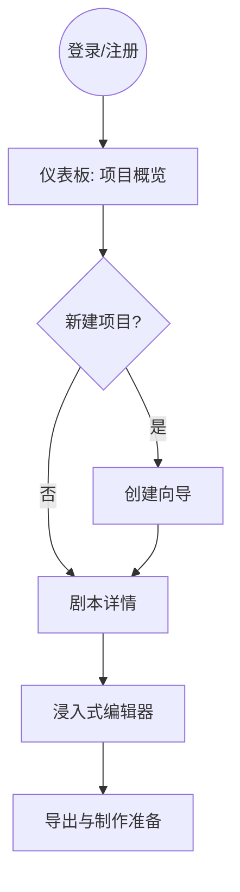

# 剧灵 Scripter - 短剧剧本创作工具 PRD v2.1

**版本：** v2.1
**创建日期：** 2026-01-22
**更新日期：** 2026-01-23
**状态：** 技术栈更新版
**产品类型：** Web应用
**核心定位：** 剧灵，一支懂你的笔 — AI 驱动的短剧剧本创作管理平台

---

## 文档导航

| 文档 | 说明 |
|------|------|
| **PRD v2.0（本文档）** | 产品需求精简版 |
| [UI 设计系统](../design/ui-design-system.md) | 完整视觉设计规范 |
| [技术设计文档](../tech/tech-design.md) | 技术架构与实现 |
| [实施计划](../implementation-plan.md) | 开发任务清单 |

---

## 一、产品概述

### 1.1 产品愿景

> **"让灵感，在剧本中苏醒"**

打造一个全图形化、AI驱动的短剧剧本开发工具，通过系统化的创作流程管理和智能辅助，帮助编剧和制作团队高效完成从世界观构建到制作准备的完整创作周期。

### 1.2 产品价值

| 价值点 | 说明 |
|--------|------|
| **流程化管理** | 将成功的创作流程固化到产品中，引导用户遵循最佳实践 |
| **AI辅助创作** | 集成AI能力辅助世界观生成、人物创作、剧本优化 |
| **全图形化界面** | 提供直观的可视化操作界面，无需技术背景 |
| **协作友好** | 支持团队协作，满足个人到公司的不同规模需求 |

### 1.3 核心创作流程


### 1.4 核心用户路径



---

## 二、市场与用户

### 2.1 市场机会

| 指标 | 数据 |
|------|------|
| **市场规模** | 2023年超过370亿元，2024年预计突破500亿元 |
| **内容需求** | 年产量超10万部，每部80-100集 |
| **行业痛点** | 制作周期短（2-4周），剧本创作效率是瓶颈 |

**竞争差异**：
- ✅ 短剧专属（80-100集、快节奏、强反转）
- ✅ AI深度集成（辅助而非替代）
- ✅ 中文优先（剧本格式规范v2.0）
- ✅ 性价比高（¥299/年 vs Final Draft $249/年）

### 2.2 用户画像

| 用户类型 | 占比 | 核心需求 | 支付意愿 | 优先级 |
|---------|------|---------|---------|--------|
| **独立编剧** | 40% | 效率工具、AI辅助 | 中等 | P0 |
| **业余创作者** | 30% | 降低门槛、学习引导 | 低 | P0 |
| **编剧团队** | 20% | 协作、版本管理 | 高 | P1 |
| **制作公司** | 10% | 全流程管理 | 很高 | P2 |

### 2.3 用户痛点总结

| 痛点 | 严重程度 | 影响用户 | Scripter 解决方案 |
|------|---------|---------|------------------|
| **创作流程混乱** | 🔴 高 | 所有用户 | 引导式创作流程 |
| **内容一致性难保证** | 🔴 高 | 新手、职业编剧 | AI 自动检查 |
| **格式规范难统一** | 🟠 中 | 新手、业余创作者 | 实时格式检查 |
| **创作门槛高** | 🟠 中 | 新手、业余创作者 | AI 辅助生成 |
| **协作效率低** | 🟡 低 | 团队、制作公司 | 实时协作 + 版本控制 |

---

## 三、功能需求

### 3.1 功能模块架构

```
Scripter
├── 项目管理模块
│   ├── 仪表板首页
│   ├── 项目创建向导
│   └── 创作进度追踪
├── 世界观构建模块
│   ├── 时代背景设定
│   ├── 地理环境设定
│   └── 社会阶层设定
├── 人物塑造模块
│   ├── 人物小传编辑
│   └── 人物成长轨迹
├── 剧本创作模块
│   ├── 故事大纲编辑
│   ├── 场景列表管理
│   └── 剧本编辑器（核心）
├── 优化完善模块
│   ├── 对白优化
│   ├── 节奏调整
│   └── 逻辑检查
├── 制作准备模块
│   ├── 分镜管理
│   └── 角色选型建议
└── AI辅助模块
    ├── 意图路由系统
    ├── 原子化技能(Skills)
    └── 专家代理(Agents)
```

### 3.2 MVP 功能范围（第一阶段）

**核心目标：** 验证"剧本编辑 + AI 辅助"的核心价值

#### P0 必须功能（同步开发）

| 模块 | 功能 | 验收标准 |
|------|------|---------|
| **控制台 Dashboard** | 项目概览、今日字数、最近编辑 | 30秒内加载；显示最近5个项目 |
| **剧本 Editor** | A4标准布局、段落拖拽、AI润色 | 支持4种元素；格式检查准确率≥95% |
| **人物 Characters** | 人物档案卡片、AI生成人设 | 卡片流展示；支持AI生成 |
| **场景 Scenes** | 看板管理、环境标签、状态流转 | 拖动调整顺序；自动重新编号 |
| **世界观 Worldview** | 多维设定、结构化编辑 | 时代/地理/阶层分类编辑 |
| **分镜 Storyboard** | 分镜脚本编辑、画面-声音排版 | 专业四栏排版 |

#### MVP 验收标准

- ✅ 用户可以在30分钟内完成第一个剧本场景创作
- ✅ AI辅助功能使用率 > 40%
- ✅ 格式检查准确率 > 95%
- ✅ 获取50个种子用户，周活跃率 > 30%

### 3.3 分阶段规划

#### 第二阶段（2-3个月）
- 高级AI功能（完整场景生成、一致性检查）
- 专注模式（隐藏侧边栏）
- 优化完善模块（批量优化、节奏分析）

#### 第三阶段（3-4个月）
- 实时协作编辑（多人同时编辑、评论批注）
- AI图片生成（人物人设图、场景概念图）
- 制作准备深化（选型建议、制作清单）

#### 第四阶段（商业功能，按需启动）
- 团队工作区
- 数据分析与报表
- 移动端适配
- API与集成

---

## 四、技术栈概览

| 层级 | 技术 | 说明 |
|------|------|------|
| **前端框架** | Next.js 16+ (App Router) | SSR/SSG支持、View Transitions、Turbopack |
| **UI组件** | shadcn/ui + Tailwind CSS | 纸质主题 (#F5F1E8 + #C9A962) |
| **编辑器** | TipTap | 无头设计、高度可定制 |
| **AI文本** | 智谱 GLM-4.7 | 国产大模型、成本更低、中文优化 |
| **AI图片** | T8Star (nano-banana-2) | 专业图片生成服务 |
| **数据库** | Drizzle ORM + PostgreSQL | 高性能、SQL透明、Edge支持 |
| **认证** | Casdoor | 独立部署、可视化管理、SSO支持 |
| **拖动** | @dnd-kit/core | 现代化拖拽库 |
| **存储** | AWS S3 / 阿里云OSS | 对象存储、CDN |

### 技术选型说明

#### 为什么选择 Drizzle ORM？

| 特性 | Drizzle | Prisma (原方案) |
|------|--------|-----------------|
| 性能 | ⚡ 快 (无查询解析开销) | 中等 |
| 包大小 | ~100KB | ~3MB |
| SQL控制 | ✅ 显式、透明 | 隐式抽象 |
| Edge Runtime | ✅ 完全支持 | ❌ 不支持 |
| 类型安全 | ✅ 更精确 | ✅ 良好 |
| 迁移灵活度 | ✅ SQL优先 | ⚠️ 自定义受限 |

**决策理由**: Drizzle 提供更好的性能和 SQL 透明度，完全支持 Edge Runtime，更适合现代 Web 应用。

#### 为什么选择 Casdoor？

| 特性 | Casdoor | NextAuth.js (原方案) |
|------|---------|---------------------|
| 部署方式 | ✅ 独立服务 | 应用内集成 |
| 管理界面 | ✅ 完整Web UI | ❌ 无 |
| 多租户 | ✅ 原生支持 | ⚠️ 有限 |
| SSO | ✅ 内置 | ⚠️ 需自建 |
| 协议支持 | OAuth 2.0 + OIDC + SAML | OAuth 2.0 |

**决策理由**: Casdoor 提供企业级身份管理，可视化管理界面降低运维成本，支持未来扩展。

#### 为什么选择智谱 GLM-4.7？

| 特性 | 智谱 GLM-4.7 | Vercel AI SDK (OpenAI) |
|------|--------------|----------------------|
| 成本 | ¥0.50/百万tokens | $30/百万tokens |
| 中文能力 | ✅ 专门优化 | 良好 |
| 国内合规 | ✅ 合规 | ⚠️ 需考虑 |
| API稳定性 | ✅ 国内节点 | ❌ 依赖海外 |

**决策理由**: 成本降低 95%+，中文能力更强，国内访问更稳定。

> 详见 [技术设计文档](../tech/tech-design.md) | [迁移计划](../tech/migration-plan-drizzle-casdoor.md)

---

## 五、数据模型

### 5.1 核心实体

```typescript
// 项目
interface Project {
  id: string
  name: string
  genre: string[]
  targetEpisodes: number
  currentStage: 'worldview' | 'character' | 'script' | 'optimize' | 'production'
  createdAt: Date
  updatedAt: Date
}

// 人物
interface Character {
  id: string
  projectId: string
  name: string
  poem: string // 人物诗号
  basicInfo: { age, gender, occupation, appearance }
  personality: string[]
  speechStyle: string
  behaviorPattern: string
  growthArc: string
  relationships: Relationship[]
}

// 场景
interface Scene {
  id: string
  projectId: string
  episodeNumber: number
  sceneNumber: number
  location: string
  timeOfDay: string
  intExt: string
  content: string // TipTap JSON
  duration: number // 秒
  status: 'draft' | 'completed'
}

// 剧本版本
interface ScriptVersion {
  id: string
  scriptId: string
  version: number
  label?: string
  isMilestone: boolean
  createdAt: Date
}
```

---

## 六、商业模式

### 6.1 定价策略

| 版本 | 价格 | 功能限制 |
|------|------|---------|
| **免费版** | ¥0 | 1个项目、基础AI、500次/月 |
| **个人版** | ¥299/年 | 5个项目、高级AI、5000次/月 |
| **团队版** | ¥999/年 | 20个项目、协作功能、20000次/月 |
| **企业版** | ¥2999/年 | 无限项目、专属支持 |

### 6.2 成本预算（第一年）

| 项目 | 金额 |
|------|------|
| 服务器 + 数据库 | ¥12,000 |
| AI API 成本 | ¥30,000 |
| 域名 + 存储 | ¥3,000 |
| **总计** | **¥45,000** |

### 6.3 收入预测

| 指标 | 第一年 | 第二年 | 第三年 |
|------|--------|--------|--------|
| 用户数 | 1,000 | 5,000 | 20,000 |
| 付费转化率 | 5% | 8% | 10% |
| 年收入 | ¥15,000 | ¥120,000 | ¥600,000 |

---

## 七、验收标准

### 7.1 MVP 功能验收

| 功能 | 验收标准 | 优先级 |
|------|---------|--------|
| **控制台** | 30秒内加载；显示最近5个项目；玻璃拟态卡片 | P0 |
| **编辑器** | 支持4种元素；实时格式检查准确率≥95%；A4布局 | P0 |
| **拖动** | 场景拖动自动重新编号；段落拖动显示金色指示线 | P0 |
| **人物** | 卡片流展示；AI生成人设；诗号生成 | P0 |
| **世界观** | 多维设定编辑；结构化展示 | P0 |
| **分镜** | 四栏排版；运镜建议 | P0 |
| **AI助手** | 意图路由；3个以上Skill；流式响应 | P0 |

### 7.2 非功能性验收

| 指标 | 目标 | 优先级 |
|------|------|--------|
| **性能** | 首屏加载 < 2秒；编辑器响应 < 100ms | P0 |
| **可用性** | 正常运行时间 > 99% | P0 |
| **兼容性** | Chrome/Edge/Safari 最新版；移动端响应式 | P1 |
| **安全** | 数据加密传输；AI配额控制 | P0 |

---

## 八、风险评估

### 8.1 风险矩阵

| 风险 | 概率 | 影响 | 优先级 | 应对策略 |
|------|------|------|--------|----------|
| **AI API 成本超预算** | 中 | 高 | **P0** | 配额严格控制；分级定价；使用监控 |
| **TipTap 协作实现复杂** | 高 | 中 | P1 | MVP阶段暂缓，使用乐观锁 |
| **移动端性能问题** | 中 | 中 | P2 | 懒加载；虚拟滚动 |
| **用户增长不及预期** | 中 | 高 | P1 | 内容营销；免费试用延长 |
| **竞品快速模仿** | 高 | 中 | P2 | 建立品牌护城河；社区运营 |

### 8.2 技术风险应对

| 风险 | 应对措施 |
|------|----------|
| LLM 上下文限制 | 分块处理；特征提取；智能压缩 |
| 实时协作冲突 | 乐观锁；操作转换(OT) |
| 图片生成成本 | 用户配额；异步任务队列 |
| 数据库性能 | 索引优化；缓存策略 |

---

## 九、成功指标

### 9.1 产品指标

| 指标 | 目标 | 时间框架 |
|------|------|---------|
| **注册用户** | 1,000 | 6个月 |
| **付费转化率** | 5% | 6个月 |
| **周活跃率** | 30% | 3个月 |
| **用户满意度** | 4.0/5.0 | 持续 |

### 9.2 功能指标

| 指标 | 目标 |
|------|------|
| 格式符合率 | ≥ 95% |
| 时长准确率 | ≥ 90% |
| 场景生成时间 | ≤ 2分钟 |
| AI使用率 | ≥ 40% |

---

## 十、附录

### 10.1 相关文档

- [UI 设计系统](../design/ui-design-system.md) - 完整视觉设计规范
- [技术设计文档](../tech/tech-design.md) - 技术架构与实现
- [实施计划](../implementation-plan.md) - 开发任务清单
- [中文短剧剧本格式规范 v2.0](../../script-format-v2.md) - 剧本格式标准

### 10.2 版本历史

| 版本 | 日期 | 变更 |
|------|------|------|
| v2.1 | 2026-01-23 | 技术栈更新：Drizzle ORM + Casdoor + GLM-4.7 + T8Star |
| v2.0 | 2026-01-23 | 精简优化版；引用设计参考；补充验收标准 |
| v1.6 | 2026-01-23 | P0问题修复 + P1/P2技术细节补充 |
| v1.0 | 2026-01-22 | 初始版本 |

---

**让灵感，在剧本中苏醒** ✨
